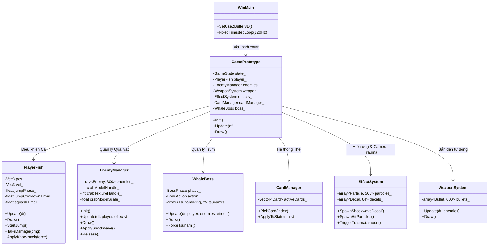
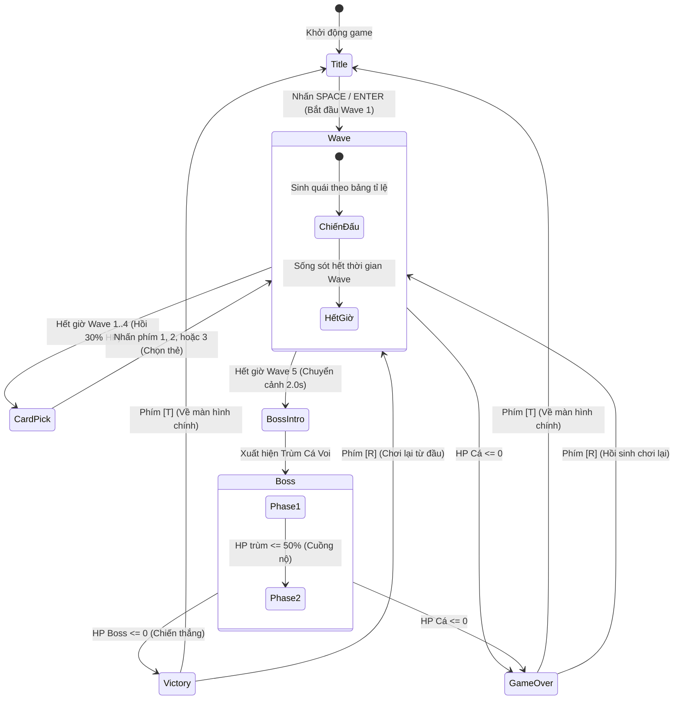
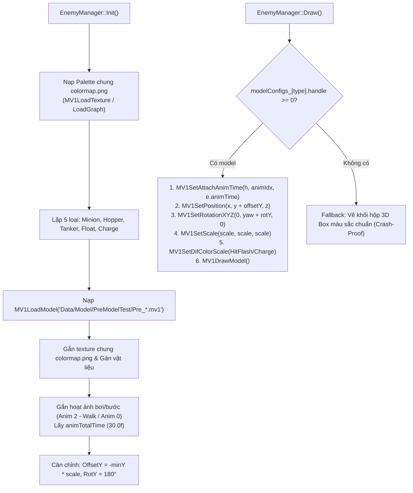
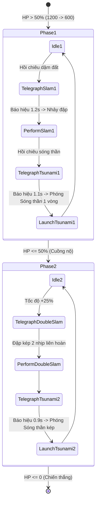

# 躍る (Odoru) — Tổng hợp Toàn bộ Cấu trúc & Kiến trúc Game Hiện tại

> [!INFO] 🔗 Mạng lưới Liên kết Ghi chú (Obsidian Vault Links)
> - 📄 **Tài liệu Ý tưởng & Thiết kế Gốc**: [[fish game|fish game.md]]
> - 📑 **Hồ sơ Đặc tả Kỹ thuật Chi tiết**: [[Odoru_Technical_Specification|Odoru_Technical_Specification.md]]
> - 📌 **Hướng dẫn Dự án & Phím tắt**: [[README|README.md]]

> [!ABSTRACT] Tóm tắt Kiến trúc Dự án
> **躍る (Odoru)** là tựa game 3D Arena Survivor / Roguelite (lấy cảm hứng từ *Brotato* kết hợp cơ chế platformer 3D) được phát triển bằng **C++17 thuần** và thư viện đồ họa **DxLib** trên nền tảng Visual Studio 2022 (x64). Toàn bộ hệ thống được tự lập trình kiến trúc từ tầng thấp (Low-level), không dùng Game Engine thương mại.
> Trò chơi sở hữu cơ chế gameplay độc đáo **"Nhảy để tấn công" (Jump-to-Attack)**: Người chơi điều khiển cá bơi mượt mà trên sàn đấu, nhấn Space nhảy vọt lên không trung (bất tử khi bay) và tiếp đất dập sóng chấn động quét sạch đàn quái vật.
> Tài liệu này mô tả chi tiết 100% cấu trúc trò chơi hiện tại: từ luồng thực thi, kiến trúc module, cơ chế điều khiển cá, hệ thống quái vật (bao gồm **tích hợp mô hình 3D Cua**), boss cá voi khổng lồ, hệ thống 8 thẻ Roguelite, đến hiệu ứng game feel và phím nóng kiểm thử.

---

## 1. Sơ đồ Kiến trúc Tổng thể & Phân rã Module

Trò chơi áp dụng kiến trúc Module hướng đối tượng kết hợp Data-Oriented Design (mảng tĩnh, struct phẳng) để triệt tiêu việc cấp phát bộ nhớ động trong vòng lặp game loop.

### 1.1. Danh mục Tệp Mã nguồn & Phân công Trách nhiệm

| Tệp nguồn | Trách nhiệm chính |
|---|---|
| `Main.cpp` | Điểm khởi nhập WinMain, thiết lập Z-buffer 3D, ánh sáng, bộ theo dõi cấp phát bộ nhớ (Allocation Tracker), vòng lặp Fixed Timestep 120Hz. |
| `Consts.h` | Trung tâm tham số toàn cục: Tỉ lệ scale mô hình Cua, máu, sát thương, tốc độ, giới hạn màn hình, thời gian wave. |
| `GamePrototype.h / .cpp` | Bộ điều phối trung tâm (Game Director): Quản lý 8 trạng thái game, camera 3D mượt, HUD, phím gỡ lỗi. |
| `PlayerFish.h / .cpp` | Thực thể Cá người chơi: Bơi lội WASD không khựng, nhảy parabol giải tích, bất tử trên không, dập sóng tiếp đất. |
| `Enemy.h / .cpp` | Quản lý 300 kẻ địch: 5 loại quái, **nạp và hiển thị Model 3D Cua (`kanisan3D.mv1`)**, cơ chế tách va chạm và đẩy lùi. |
| `Boss.h / .cpp` | Trùm cuối Cá Voi: 2 Phase, chiêu nhảy đập sàn, đập kép, vành sóng thần tỏa tròn (Radial Tsunami). |
| `Card.h`, `CardDatabase.h`, `CardManager.cpp` | Hệ thống 8 thẻ Roguelite: Chọn ngẫu nhiên 3 thẻ, tính toán cộng dồn chỉ số người chơi. |
| `Bullet.h / .cpp` | Vũ khí tự động bắn: Pool 600 viên đạn, tìm quái gần nhất, tính va chạm đạn-quái. |
| `Effects.h / .cpp` | Hệ thống hạt (Particles), Decal sóng nước trên sàn, bọt khí nổi, rung chấn camera đa trục. |
| `Render3DUtil.h` | Thư viện vẽ nguyên thủy 3D tối ưu: Hộp xoay 3D, bóng dẹt giả lập, vòng tròn Decal sàn. |
| `Vector3.h`, `DxConv.h` | Cấu trúc toán học vector 3 chiều và chuyển đổi kiểu dữ liệu sang `VECTOR` của DxLib. |

---

## 2. Vòng lặp Game Loop & Máy trạng thái (Game State Machine)

### 2.1. Vòng lặp Fixed Timestep 120Hz (Game Loop)
Để vật lý và va chạm luôn ổn định bất kể tần số quét màn hình, game sử dụng thuật toán tích lũy thời gian cố định:
- Bước thời gian cố định: $\Delta t = \frac{1}{120}\,\text{s} \approx 0.008333\,\text{s}$ (`FIXED_TIMESTEP`).
- Thuật toán chống trễ (Spiral of death): Chặn `frameTime <= 0.1s`.
- Kiểm soát bộ nhớ: Giữ `g_gameplayAllocCount == 0` tuyệt đối trong vòng lặp chính.

### 2.2. Sơ đồ Chuyển đổi Trạng thái (8 Game States)

---

## 3. Cơ chế Cá Chính (PlayerFish) & Hệ thống Tấn công

### 3.1. Bảng Thông số Cốt lõi của Cá

| Thông số | Hằng số / Thuộc tính | Giá trị cơ bản | Ý nghĩa & Cơ chế |
|---|---|:---:|---|
| **Máu tối đa** | `maxHp` | $100.0\,\text{HP}$ | Lượng sinh mệnh ban đầu |
| **Tốc độ bơi ngang** | `FISH_SPEED` | $280.0\,\text{unit/s}$ | Vận tốc lướt sàn đấu XZ |
| **Bán kính Hitbox** | `GetHitboxRadius()` | $18.0\,\text{unit}$ | Bán kính va chạm nhận sát thương |
| **Thời gian bay trên không** | `JUMP_DURATION` | $0.60\,\text{s}$ | Thời lượng 1 chu kỳ nhảy parabol ($T$) |
| **Độ cao cực đại** | `JUMP_HEIGHT` | $85.0\,\text{unit}$ | Đỉnh cao độ cú nhảy ($H$) |
| **Hồi chiêu cú nhảy** | `JUMP_COOLDOWN` | $1.20\,\text{s}$ | **Chỉ tính từ lúc tiếp đất chạm sàn** (Min: $0.40\,\text{s}$) |
| **Sát thương dậm đất** | `SLAM_DAMAGE` | $40.0\,\text{dmg}$ | Sát thương nổ tại tâm cú tiếp đất |
| **Bán kính dậm đất** | `SLAM_RADIUS` | $120.0\,\text{unit}$ | Bán kính lan tỏa sóng xung kích (Max: $240.0\,\text{unit}$) |
| **Lực đẩy dậm đất** | `SLAM_KNOCKBACK` | $320.0\,\text{unit/s}$ | Gia tốc đẩy lùi quái vật ra xa |

### 3.2. Di chuyển Bơi lội Mượt mà (Smooth Swimming)
- **Tọa độ**: Giữ cố định $Y = 0.0$ khi ở mặt sàn. Di chuyển 8 hướng bằng `WASD`.
- **Góc quay hướng (Yaw)**: $\text{Yaw} = \text{atan2}(v_x, v_z)$.
- **Hoạt ảnh vẫy đuôi**: $\theta_{\text{tail}} = 0.25 \cdot \sin(14.0 \cdot t_{\text{swim}})$ tạo cảm giác sống động trong nước.
- **Tiếp tục bơi ngay khi tiếp đất**: Tách hoàn toàn hoạt ảnh dội nảy thể tích (Squash & Stretch) ra khỏi logic tọa độ. Ngay khung hình đáp đất $t = 1.0$, nếu người chơi tiếp tục giữ phím WASD, cá lập tức lướt đi không bị khựng lại một tích tắc nào.

### 3.3. Cơ chế Nhảy Parabol Giải tích (Parabolic Jump Arc)
- Nhấn phím `SPACE` khi ở mặt đất và hết hồi chiêu.
- Công thức quỹ đạo cao độ giải tích:
  $$y(t) = 4 \cdot H \cdot t \cdot (1 - t) \quad \text{với } t = \frac{\Delta t_{\text{jump}}}{T} \in [0, 1]$$
- **Bất tử trên không (Airborne Invincibility)**: Khi $y(t) > 0.01$, thân cá phát ánh sáng vàng kim, **hoàn toàn miễn nhiễm mọi sát thương va chạm** từ quái vật, quái lao và sóng thần của Boss.
- **Vòng tròn Decal dự đoán điểm rơi**: Khi đang bay, hệ thống chiếu Decal tròn xuống mặt sàn tại tọa độ dự đoán:
  $$\vec{P}_{\text{land}} = \vec{P}_{XZ} + \vec{V}_{\text{air}} \cdot (1 - t) \cdot T$$

### 3.4. Cú Dậm Tiếp Đất (Slam Shockwave)
- Khi chạm đất ($t = 1.0$):
  - Kích hoạt chấn động rung camera (`TriggerTrauma(0.25)`).
  - Tạo vòng tròn Decal sóng nước loang dần trong $0.4\,\text{s}$ tại vị trí tiếp đất.
  - Quét va chạm hình cầu bán kính `SLAM_RADIUS` ($120.0\,\text{unit}$): Quái trúng đòn chịu `SLAM_DAMAGE` và bị đẩy lùi theo vector hướng ra ngoài với lực `SLAM_KNOCKBACK`.
  - **Hit-Stop**: Nếu trúng từ 3 quái trở lên, kích hoạt đóng băng khung hình $0.04\,\text{s}$ tạo cảm giác lực cực kỳ đã tay.

### 3.5. Cơ chế Nhận Sát thương & Đẩy lùi (Knockback Rebalance)
- Sát thương quái đánh trúng cá đã được cân bằng lại (giảm từ 10~22 xuống 5~12 HP/hit).
- Sau khi bị trúng đòn, cá có **0.8 giây miễn nhiễm (I-Frame)** với hiệu ứng chớp tắt.
- **Knockback 2 chiều khi va chạm**:
  - Cá chính bị nảy nhẹ theo hướng bị húc: $\vec{F}_{\text{player}} = \vec{D}_{\text{push}} \times 160.0\,\text{unit/s}$.
  - Quái vật bị nảy dội ngược về phía sau: $\vec{F}_{\text{enemy}} = -\vec{D}_{\text{push}} \times 180.0\,\text{unit/s}$.

---

## 4. Hệ thống Quái vật (EnemyManager) & Tích hợp Bộ Mô hình 3D Đa Quái (PreModelTest)

### 4.1. Bảng Thông số 5 Loại Quái vật & Mô hình 3D Tương ứng

| Loại quái vật | Mô hình 3D (`PreModelTest`) | Máu (HP) | Tốc độ | Hitbox (R) | Scale chuẩn | RotY bù | Offset Y | Hành vi đặc trưng |
|---|---|:---:|:---:|:---:|:---:|:---:|:---:|---|
| **Minion** | `Pre_Minion.mv1` | 26 | 110 | 13 | 0.20 | $180^\circ$ | 6.0 | Áp sát bầy đàn cơ bản |
| **Hopper (Cua)** | `Pre_Carb.mv1` (hoặc fallback `kanisan3D.mv1`) | 38 | 135 | 15 | 0.16 | $180^\circ$ | 4.8 | Nhảy tưng tưng chu kỳ $0.32\,\text{s}$, cao $32\,\text{unit}$ |
| **Tanker (Rùa)** | `Pre_Turtle.mv1` | 130 | 65 | 24 | 0.32 | $180^\circ$ | 9.6 | Rùa mai dày trâu bò, cản đường |
| **Float (Sứa)** | `Pre_Jellyfish.mv1` | 42 | 95 | 16 | 0.22 | $180^\circ$ | 6.6 | Sứa bay lơ lửng ở cao độ $Y = 18\,\text{unit}$ |
| **Charge (Cá mập)** | `Pre_Shark.mv1` | 60 | 120 | 18 | 0.26 | $180^\circ$ | 7.8 | Khựng báo hiệu đỏ rực 0.65s $\rightarrow$ Lao vút $3.2\times$ tốc độ |

### 4.2. Kiến trúc Nạp & Render Mô hình 3D Đa Quái

Toàn bộ 5 loại quái vật đã được nâng cấp đồng bộ từ khối lập phương 3D lên mô hình 3D hoàn chỉnh:

#### Chi tiết Kỹ thuật Bộ Mô hình 3D:
1. **Texture Bảng màu Dùng chung (Shared Palette):**
   - Tệp dải màu: `Data/Model/PreModelTest/colormap.png` (ảnh palette $512 \times 512$).
   - Nạp 1 lần duy nhất tại `EnemyManager::Init()`, liên kết đồng bộ vào toàn bộ các texture slot của 5 mô hình qua `MV1SetTextureGraphHandle` và `MV1SetTextureColorFilePath`.
2. **Hoạt ảnh 3D Độc lập cho Từng Con Quái (Per-Instance Anim State):**
   - Mỗi con quái (`struct Enemy`) lưu trữ `float animTime` riêng biệt, không làm chậm hay phụ thuộc lẫn nhau.
   - Khi di chuyển, `e.animTime` tăng theo tốc độ khung hình. Cá mập khi lao tăng tốc hoạt ảnh $2.5\times$.
   - Tại `EnemyManager::Draw()`, `MV1SetAttachAnimTime` được thiết lập ngay trước lệnh `MV1DrawModel`, tái tạo dáng pose chính xác cho từng con quái mà không cấp phát heap (`0 heap allocations`).
3. **Phím Nóng Tinh chỉnh Debug Thời gian Thực:**
   - Phím `N`: Chuyển đổi giữa 5 loại quái cần căn chỉnh (`Minion` $\rightarrow$ `Hopper` $\rightarrow$ `Tanker` $\rightarrow$ `Float` $\rightarrow$ `Charge`).
   - Phím `,` (dấu `<`): Giảm tỉ lệ Scale của loại quái đang chọn (bước $0.02$).
   - Phím `.` (dấu `>`): Tăng tỉ lệ Scale của loại quái đang chọn (bước $0.02$).
   - Phím `M`: Xoay đổi góc hướng mặt $+90^\circ$ cho loại quái đang chọn.
   - Hiển thị trực quan trên Debug Panel: `Enemy 3D [Hopper]: Scale=0.16 (< / >) | RotY=180 deg (M) | Switch (N)`.
4. **Cơ chế Fallback Kép An toàn (Double Fallback):**
   - Quái Cua `Hopper` ưu tiên nạp `Pre_Carb.mv1`, nếu thiếu sẽ tự động tìm `Data/Model/Kani/kanisan3D.mv1`.
   - Nếu bất kỳ tệp mô hình nào bị thiếu hoặc lỗi, game tự động chuyển sang vẽ khối hộp 3D màu tương ứng, hoàn toàn không crash.
   - Giải phóng tài nguyên sạch sẽ tại `EnemyManager::Shutdown()` và `Release()`.

### 4.3. Bảng Tỉ lệ Sinh Quái qua 5 Wave

- **Wave 1 (30s)**: 75% Minion + **25% Hopper Cua 3D** (cho phép người chơi chiêm ngưỡng mô hình mới ngay từ đầu).
- **Wave 2 (30s)**: 70% Minion + 30% Hopper.
- **Wave 3 (35s)**: 45% Minion + 30% Hopper + 15% Tanker + 10% Float.
- **Wave 4 (35s)**: 30% Minion + 25% Hopper + 20% Tanker + 13% Float + 12% Charge.
- **Wave 5 (40s)**: Tổng lực hỗn hợp: 20% Minion + 20% Hopper + 20% Tanker + 20% Float + 20% Charge.

---

## 5. Hệ thống Trùm cuối (WhaleBoss - Cá Voi Khổng Lồ)

Trùm xuất hiện sau khi hoàn thành Wave 5, sở hữu kích thước khổng lồ ($R = 55.0\,\text{unit}$) và lượng máu $1200.0\,\text{HP}$.

### 5.1. Kỹ năng Sóng thần Tỏa tròn (Radial Tsunami)
- **Cơ chế**: Boss đập mạnh xuống tâm đấu trường, phát ra vành sóng hình xuyến lan dần ra rìa sàn đấu:
  $$R_{\text{tsunami}}(t) = R_{\text{start}} + V_{\text{tsunami}} \cdot t$$
- **Thông số kỹ thuật:**
  - Tốc độ lan tỏa: $260\,\text{unit/s}$ (Phase 1) $\rightarrow$ $320\,\text{unit/s}$ (Phase 2).
  - Bề dày vành sóng: $90.0\,\text{unit}$.
  - Chiều cao sóng: $40.0\,\text{unit}$.
  - Sát thương: $25.0\,\text{dmg}$ + Đẩy lùi mạnh $220.0\,\text{unit/s}$ ra ngoài.
- **Cách né tránh (Bắt buộc Nhảy)**: Người chơi phải canh đúng lúc vành sóng chạm tới vị trí của mình và nhấn `SPACE` nhảy vọt qua sóng. Khi đang ở trên không ($Y > 0$), vành sóng hoàn toàn vô hại.

---

## 6. Hệ thống Nâng cấp Roguelite (CardManager - 8 Thẻ Nâng Cấp)

Sau mỗi Wave thành công, giao diện tự động tạm dừng và hiển thị **3 Thẻ nâng cấp ngẫu nhiên (không trùng lặp)** để người chơi lựa chọn bằng phím `1`, `2`, `3` hoặc di chuyển chọn bằng phím điều hướng + `Enter`. Đồng thời, người chơi được **hồi 30% máu tối đa** (`WAVE_HEAL_PERCENT = 0.30f`).

### 6.1. Danh mục 8 Thẻ Nâng Cấp

| STT | ID Thẻ | Tên Thẻ Nâng Cấp | Độ hiếm | Lợi ích cốt lõi | Đánh đổi rủi ro |
|:---:|---|---|:---:|---|---|
| 1 | `vucsau` | Vực sâu (Deep Trench) | Common | Bán kính dậm đất `slamRadius +25%` | Không có đánh đổi |
| 2 | `cudam` | Cú dậm (Heavy Slam) | Common | Sát thương dậm đất `slamDamage +40%` | Hồi chiêu nhảy `jumpCooldown +15%` |
| 3 | `nhaygon` | Nhảy gọn (Nimble Leap) | Common | Hồi chiêu nhảy giảm `jumpCooldown -20%` | Sát thương dậm đất `slamDamage -10%` |
| 4 | `vaynhanh` | Vây nhanh (Swift Fins) | Common | Tốc độ bơi `moveSpeed +15%` | Không có đánh đổi |
| 5 | `daday` | Da dày (Thick Scales) | Common | Máu tối đa `maxHp +30%` | Tốc độ bơi `moveSpeed -8%` |
| 6 | `songdoi` | Sóng dội (Echo Wave) | Rare | Bán kính dậm `+35%`, lực đẩy `+30%` | Sát thương dậm đất `slamDamage -10%` |
| 7 | `canoc` | Cá nóc (Puffer Needles) | Rare | Bị trúng đòn tự động bắn 8 gai nhọn phản đòn | Máu tối đa `maxHp -15%` |
| 8 | `cudapnang` | Cú đáp nặng (Crushing Impact) | Epic | Đẩy lùi quái `+100%`, sát thương dậm `+30%` | Hồi chiêu nhảy `jumpCooldown +20%` |

---

## 7. Hệ thống Vũ khí, Hiệu ứng & Game Feel

### 7.1. Súng Ngắm Tự Động (WeaponSystem)
- Tự động quét tìm quái gần nhất qua thuật toán khoảng cách Euclid $O(N)$ trong bán kính $450.0\,\text{unit}$.
- Quản lý bộ đệm tĩnh `std::array<Bullet, 600>` không sinh rác bộ nhớ.
- Khi bắn trúng quái, tạo tia nổ và đẩy nhẹ quái vật.

### 7.2. Hiệu ứng Hình ảnh (EffectSystem)
- **Số Sát Thương Nổi (Floating Damage Numbers / Popups)**:
  - Khi người chơi dậm đất trúng quái vật, Boss hoặc đạn/gai bắn trúng, số sát thương sẽ tự động nảy lên trên đầu mục tiêu.
  - Tọa độ 3D trong thế giới thực được chiếu trực tiếp lên tọa độ pixel màn hình 2D thông qua `ConvWorldPosToScreenPos(worldPos)`.
  - Hiệu ứng vật lý: Bay vọt lên trên với lực nảy ban đầu, giảm tốc độ theo trọng lực và mờ dần trong $0.70\,\text{s} - 0.85\,\text{s}$.
  - Độ tương phản cao: Có viền đen 4 hướng dày dặn giúp nhìn rõ trên mọi nền địa hình và hiệu ứng.
  - Phân loại trực quan: Đòn bình thường hiển thị màu trắng ngà (`FontSize::Body`); Đòn chí mạng / Nổ to / Dậm phá giáp Rùa Tanker hiển thị màu vàng kim rực rỡ kèm dấu chấm than (`FontSize::Medium`, ví dụ `60!`).
  - Quản lý bộ đệm tĩnh `std::array<DamagePopup, 128>` đạt chuẩn $0$ cấp phát heap (`0 heap allocations`) ở $120\,\text{Hz}$.
- **Decal Sóng Nước Mặt Sàn**: Vòng tròn tỏa ra có độ trong suốt Alpha giảm dần theo hàm mũ $\alpha(t) = 1.0 - \left(\frac{t}{t_{\max}}\right)^2$.
- **Hệ thống Hạt Nước (Water Particles)**: Bọt khí, vệt nước xoáy, mảnh vỡ khi quái bị tiêu diệt.
- **Rung Camera Đa Trục (Camera Trauma System)**:
  $$\text{Trauma} \in [0, 1] \implies \text{Offset} = \text{Trauma}^2 \times \text{MaxOffset} \times \text{Noise}$$

### 7.3. Camera 3D Bám Mượt (Smooth Camera Follow)
- Góc nghiêng Pitch: $50.0^\circ$ (tùy chỉnh được từ $25^\circ \rightarrow 85^\circ$).
- Khoảng cách bám: $580.0\,\text{unit}$.
- Công thức bám mượt thời gian thực:
  $$\vec{P}_{\text{cam}}(t + \Delta t) = \vec{P}_{\text{cam}}(t) + (\vec{P}_{\text{target}} - \vec{P}_{\text{cam}}(t)) \cdot (1 - e^{-k \cdot \Delta t})$$
  với $k = 6.5$ (`CAM_FOLLOW_SPEED`).

---

## 8. Bảng Phím tắt Điều khiển & Phím Debug Dành cho Nhà Phát Triển

### 8.1. Phím Điều khiển Người chơi
- `W / A / S / D` hoặc `Mũi tên`: Bơi lội tự do trên mặt sàn.
- `SPACE`: Nhảy vọt lên không trung dậm đất.
- `Phím 1, 2, 3`: Chọn thẻ nâng cấp trong màn hình CardPick.
- `ENTER`: Bắt đầu trò chơi tại màn hình Title.
- `R`: Khởi động lại màn chơi (Reset).
- `T`: Quay về màn hình Tiêu đề (khi Thắng/Thua).
- `ESC`: Thoát game.

### 8.2. Phím Gỡ lỗi & Kiểm thử (Debug Hotkeys)

| Phím tắt | Chức năng kiểm thử | Ý nghĩa kỹ thuật |
|---|---|---|
| `F1` | Bật / Tắt Bảng Debug HUD | Xem cấp phát RAM (Heap Allocs), thông số Cá, Model Cua, Boss |
| `F2` | Bật / Tắt Rung Camera | Kiểm thử độ ổn định khung nhìn khi dậm đất |
| `F8` | Bỏ qua Wave hiện tại | Nhảy nhanh qua Wave tiếp theo để kiểm tra tiến trình |
| `Shift + F8` | Bỏ qua Wave & Bỏ chọn Thẻ | Chạy thần tốc thẳng tới trận đấu Trùm Cá Voi |
| `F9` | Bật / Tắt Bất Tử (God Mode) | Miễn nhiễm mọi sát thương để tự do kiểm tra cơ chế |
| `K` | Tiêu diệt toàn bộ Quái vật | Dọn sạch sàn đấu ngay lập tức |
| `,` (Phím `<`) | **Giảm Scale Mô hình Cua 3D ($-0.5$)** | **Tinh chỉnh nóng kích thước Cua ngay trong game** |
| `.` (Phím `>`) | **Tăng Scale Mô hình Cua 3D ($+0.5$)** | **Tinh chỉnh nóng kích thước Cua ngay trong game** |
| `M` | **Xoay góc hướng mặt Cua ($+90^\circ$)** | **Kiểm tra và bù hướng mặt 3D của Cua** |
| `[` / `]` | Chỉnh góc nghiêng Camera (Pitch $\pm 5^\circ$) | Góc nhìn từ $25^\circ$ đến $85^\circ$ |
| `-` / `;` | Chỉnh khoảng cách Camera ($\pm 40\,\text{unit}$) | Thu phóng camera từ $260$ đến $1000$ |

---

> [!TIP] Kết luận & Định hướng Hoàn thiện
> Kiến trúc hiện tại của **躍る (Odoru)** đã đạt độ hoàn chỉnh cao về cả kỹ thuật cốt lõi (Core Engine Loop, Memory Safety, 3D Rendering) và cảm giác trải nghiệm (Game Feel, Juice, Combat Loop). 
> Việc đưa thành công **Mô hình 3D Cua** vào game mở ra bước ngoặt để tiếp tục thay thế dần các khối hộp còn lại (Rùa Tanker, Sứa Float, Cá Mập Charge) bằng mô hình 3D chất lượng cao trong các giai đoạn tiếp theo!

---

## 9. Mạng lưới Liên kết Tài liệu (Obsidian Vault Graph Network)

Hệ thống ghi chú trong Obsidian Vault của dự án được liên kết 2 chiều (Bidirectional Links) để hiển thị trọn vẹn và liền mạch trong **Graph View** của Obsidian:

- [[fish game|📄 fish game.md]]: Tài liệu ý tưởng, cốt lõi cơ chế và yêu cầu thiết kế ban đầu của game.
- [[Odoru_Technical_Specification|📑 Odoru_Technical_Specification.md]]: Hồ sơ đặc tả kỹ thuật chi tiết từng hàm, hằng số, công thức toán học và giải thuật.
- [[Odoru_Current_Architecture|🏛️ Odoru_Current_Architecture.md]]: Toàn bộ cấu trúc game và kiến trúc hệ thống hiện tại (bản mới nhất).
- [[README|📌 README.md]]: Hướng dẫn tổng quan về dự án, môi trường build Visual Studio và cấu hình phím tắt.
