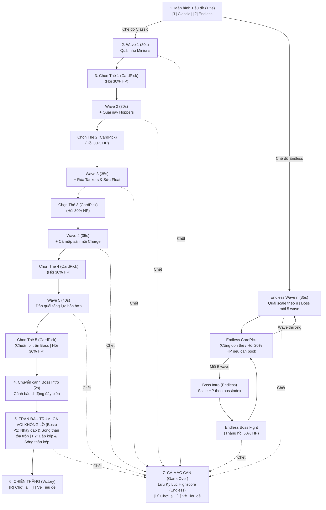
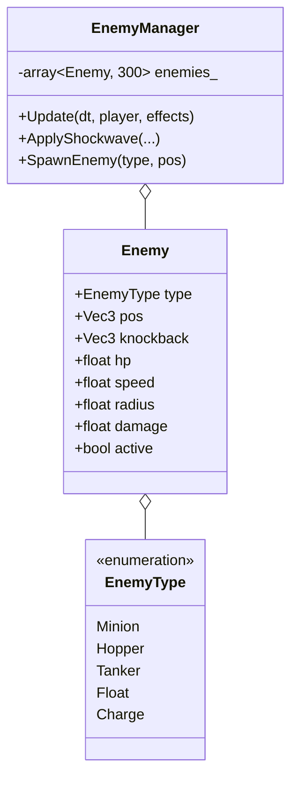
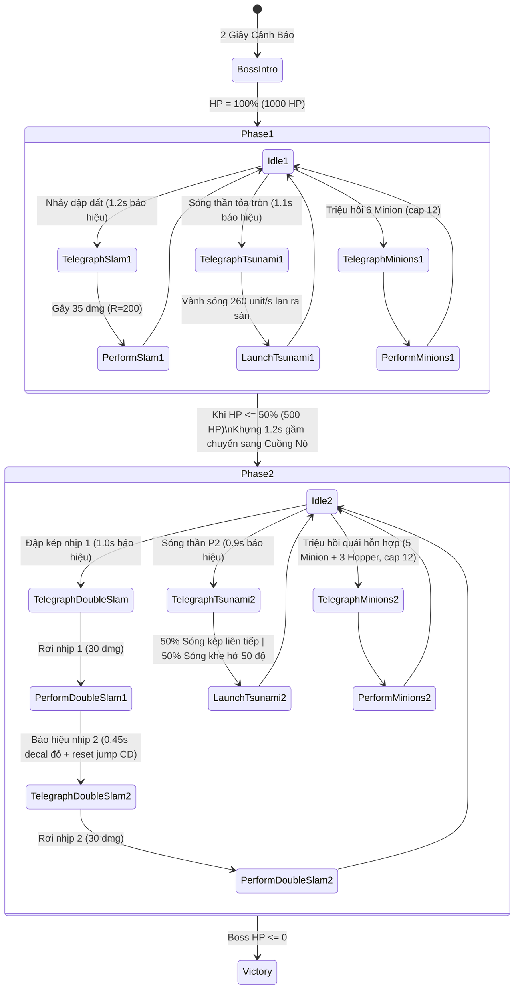

# 躍る (Odoru) — Hồ sơ Kỹ thuật & Thiết kế Game Toàn diện (Master Technical Document)

> [!INFO] 🔗 Mạng lưới Liên kết Ghi chú (Obsidian Vault Links)
> - 🏛️ **Kiến trúc Hiện tại (Bản mới nhất)**: [[Odoru_Current_Architecture|Odoru_Current_Architecture.md]]
> - 📄 **Tài liệu Ý tưởng & Thiết kế Gốc**: [[fish game|fish game.md]]
> - 📌 **Hướng dẫn Dự án & Phím tắt**: [[README|README.md]]

> [!ABSTRACT] Tóm tắt đồ án môn học
> **躍る (Odoru)** là tựa game 3D Arena Survivor / Roguelite (phong cách *Brotato*) được phát triển bằng **C++17 thuần** và thư viện đồ họa **DxLib** trên nền tảng Visual Studio 2022 (x64), tự quản lý bộ nhớ, vòng lặp thời gian và phân vùng va chạm ở tầng game mà không phụ thuộc vào game engine thương mại.
> Trò chơi triển khai cơ chế gameplay cốt lõi **"Nhảy để tấn công" (Jump-to-Attack)**: người chơi điều khiển cá bơi mượt mà bằng WASD, nhấn phím Space phóng mình lên không trung theo quỹ đạo parabol giải tích (miễn nhiễm sát thương va chạm khi bay) và tiếp đất dập sóng chấn động diện rộng để tiêu diệt đàn quái vật.
> Toàn bộ hệ thống vận hành trên vòng lặp logic cố định **120Hz Fixed Timestep**, cơ chế quản lý bộ nhớ **Zero Dynamic Allocation (Object Pooling)** trong game loop, phân vùng va chạm **Spatial Hash Grid $O(N)$**, hệ thống **8 Thẻ nâng cấp Roguelite**, và Trùm cuối **Cá Voi Khổng Lồ 2 giai đoạn** với kỹ năng **Sóng thần tỏa tròn (Radial Tsunami)**.

---

## 1. Triết lý Thiết kế & Vòng lặp Trò chơi (Game Design & Loop)

### 1.1. Chủ đề "躍る" (Odoru)
* **Nghĩa đen (Cá nảy)**: Cá di chuyển bằng cách bơi lượn trong đáy biển và phóng người lên không trung dậm đất dũng mãnh.
* **Nghĩa bóng (胸躍る - Mune ga odoru)**: Nhịp độ chiến đấu dồn dập, hồi hộp nghẹt thở. Cảm giác giải phóng căng thẳng (*Catharsis*) khi canh khoảnh khắc dậm đất dọn sạch cả đàn quái đang bủa vây.

### 1.2. Sơ đồ Luồng Trạng Thái (Game State Machine)

Hệ thống quản lý trạng thái trò chơi gồm **7 trạng thái chính** trong luồng trải nghiệm chuẩn hỗ trợ 2 chế độ: **Classic (5 Wave + Boss)** và **Endless (Sinh tồn vô tận)**:



---

## 2. Cơ chế Điều khiển & Tấn công của Cá Chính (Player Mechanics)

### 2.1. Bảng Chỉ số Gốc của Cá Chính (Base Stats)

| Thuộc tính | Ký hiệu / Hằng số | Giá trị cơ sở | Giới hạn an toàn (Clamp) | Ý nghĩa kỹ thuật |
|---|---|:---:|:---:|---|
| **Máu tối đa** | `maxHp` | $100.0\,\text{HP}$ | $\ge 20.0$ | Lượng máu ban đầu |
| **Tốc độ bơi ngang** | `FISH_SPEED` | $280.0\,\text{unit/s}$ | $\le 340.0\,\text{unit/s}$ | Vận tốc lướt trên mặt sàn XZ |
| **Bán kính Hitbox** | `GetHitboxRadius()` | $18.0\,\text{unit}$ | Cố định | Bán kính va chạm vật lý |
| **Thời gian bay cú nhảy**| `JUMP_DURATION` | $0.60\,\text{s}$ | Tùy biến theo thẻ | Thời lượng 1 chu kỳ nhảy parabol ($T$) |
| **Độ cao cực đại** | `JUMP_HEIGHT` | $85.0\,\text{unit}$ | Tùy biến theo thẻ | Đỉnh quỹ đạo nhảy ($H$) |
| **Hồi chiêu cú nhảy** | `JUMP_COOLDOWN` | $1.20\,\text{s}$ | $\ge 0.40\,\text{s}$ | Tính từ lúc tiếp đất chạm sàn |
| **Sát thương dậm đất** | `SLAM_DAMAGE` | $40.0\,\text{dmg}$ | Tùy biến theo thẻ | Sát thương nổ tại tâm cú dậm |
| **Bán kính dậm đất** | `SLAM_RADIUS` | $120.0\,\text{unit}$ | $\le 240.0\,\text{unit}$ | Phạm vi sóng xung kích lan tỏa |
| **Lực đẩy quái vật** | `SLAM_KNOCKBACK` | $320.0\,\text{unit/s}$| Tùy biến theo thẻ | Gia tốc đẩy lùi kẻ địch khi trúng sóng |

### 2.2. Di chuyển Bơi lội (Swimming Movement)
* **Mặt phẳng di chuyển**: Tọa độ $Y = 0.0$ cố định khi ở dưới đất. Di chuyển tự do 8 hướng bằng phím `WASD` hoặc Mũi tên.
* **Góc quay hướng (Yaw)**: $\text{Yaw} = \text{atan2}(v_x, v_z)$.
* **Hoạt ảnh vẫy đuôi cá**: Góc vẫy $\theta_{\text{tail}} = 0.25 \cdot \sin(14.0 \cdot t_{\text{swim}})$ tạo cảm giác cá sống động bơi trong nước.
* **Bơi liên tục sau khi đáp đất**: Tách rời hoạt ảnh dội nảy hình thể (Squash & Stretch) ra khỏi logic tọa độ. Ngay tại khung hình tiếp đất $t = 1.0$, nếu người chơi tiếp tục giữ WASD, cá tiếp tục bơi mượt mà ngay lập tức mà không bị khựng lại hay đứng yên.

### 2.3. Cơ chế Nhảy Parabol (Parabolic Jump Arc)
* **Kích hoạt**: Nhấn phím `SPACE` khi đang ở dưới sàn ($Y \le 0.01$) và bộ đếm hồi chiêu đã sẵn sàng (`jumpCooldownTimer <= 0`).
* **Thời gian bay trên không ($T$)**: $0.60\,\text{s}$ (`JUMP_DURATION`).
* **Độ cao cực đại ($H$)**: $85.0\,\text{unit}$ (`JUMP_HEIGHT`).
* **Công thức cao độ giải tích**:
  $$y(t) = 4 \cdot H \cdot t \cdot (1 - t) \quad \text{với } t = \frac{\Delta t_{\text{jump}}}{T} \in [0, 1]$$
* **Hồi chiêu cú nhảy ($T_{\text{cd}}$)**: Cơ sở $1.20\,\text{s}$ (`JUMP_COOLDOWN`), **chỉ bắt đầu tính giờ từ thời điểm cá tiếp đất**. Giới hạn an toàn hồi chiêu tối thiểu: $T_{\text{cd}} \ge 0.40\,\text{s}$ (`MIN_JUMP_COOLDOWN`).

### 2.4. Miễn nhiễm Sát thương trên không (Airborne Invincibility)
* Trong suốt khoảng thời gian $y(t) > 0.01$, thân cá phát quang ánh sáng vàng kim/neon rực rỡ.
* Cá **miễn nhiễm sát thương va chạm** từ quái vật thường, quái lao nhanh, đòn nhảy đập và kỹ năng Sóng thần tỏa tròn của Boss.

### 2.5. Vòng tròn Decal Dự đoán Điểm rơi (Predictive Landing Indicator)
* Khi cá đang bay, hệ thống liên tục tính toán tọa độ tiếp đất dự đoán theo thời gian thực:
  $$\vec{P}_{\text{land}} = \vec{P}_{XZ} + \vec{V}_{\text{air}} \cdot (1 - t) \cdot T$$
* Vẽ vòng decal kép phát sáng nhấp nháy trên mặt sàn tại $\vec{P}_{\text{land}}$ với bán kính tương ứng bán kính dậm đất ($R = 120.0$), giúp người chơi định vị điểm rơi trực quan.

### 2.6. Đòn Tấn công Dậm đất (Landing Slam Attack - Đòn đánh Duy nhất)
* Khi chạm đất ($t \ge 1.0$), kích hoạt sự kiện tiếp đất `ConsumeLandEvent()`:
  * **Bán kính sát thương ($R_{\text{slam}}$)**: Cơ sở $120.0\,\text{unit}$.
  * **Sát thương gốc ($D_{\text{slam}}$)**: $40.0\,\text{dmg}$.
  * **Độ suy giảm theo cự ly**: $D = D_{\text{slam}} \cdot \left(1.0 - 0.4 \cdot \frac{d}{R_{\text{slam}}}\right)$ ($100\%$ sát thương tại tâm, $60\%$ ở rìa ngoài $\approx 24.0\,\text{dmg}$).
  * **Lực đẩy văng (Knockback)**: $320.0\,\text{unit/s}$ đẩy dạt quái vật ra xa tâm dậm.
  * **Quy tắc đặc thù theo loài**:
    * Quái rùa giáp (Tanker): Nhận thêm $150\%$ sát thương ($1.5\times$) và bị **choáng $0.5\,\text{s}$**.
    * Quái sứa (Float): Bị trúng trọn vẹn sóng nước dù đang bay lơ lửng.
    * Boss Cá Voi: Nhận đủ sát thương dậm đất, không bị đẩy lùi.
  * **Tắt súng tự bắn**: `ENABLE_AUTO_GUN = false` tắt hoàn toàn súng tự ngắm bắn, tập trung trải nghiệm vào đòn dậm đất.

### 2.7. Cơ chế Nhận Sát thương & Knockback của Player
* **Thời gian miễn nhiễm sau va chạm (I-Frames)**: Khi bị quái cắn trúng, cá nhận $0.35\,\text{s}$ I-Frame (`invulnerableTimer = 0.35s`), thân cá nhấp nháy cam mờ, hạn chế tình trạng bị nhiều quái cắn liên tiếp gây sốc chết tức tưởi.
* **Knockback 2 chiều**:
  * Cá chính bị đẩy lùi nhẹ $160\,\text{unit/s}$ theo hướng bị húc.
  * Quái vật bị nảy dội ngược về sau $180\,\text{unit/s}$.
  * Tách rời 2 hitbox va chạm ngay lập tức, ngăn ngừa hiện tượng dính chặt vào nhau.
* **Rung Camera (Trauma)**: Sinh $0.28$ Trauma khi trúng đòn, tạo phản hồi va chạm vừa vặn.

---

## 3. Cơ chế Hành vi & Tấn công của Kẻ địch (Enemy AI & Attack Behaviors)

Tất cả kẻ địch được quản lý qua cấu trúc mảng tĩnh $300$ thực thể trong lớp `EnemyManager` (`./Enemy.h`). AI sử dụng cấu trúc `struct Enemy` kết hợp trường phân loại `EnemyType` (thay vì kế thừa đa hình nhằm đảm bảo tính liên tục của dữ liệu trong bộ nhớ Cache).



### 3.1. Bảng Chỉ số & Hành vi 5 Loài Kẻ địch Thường

| Loài quái | Kiểu hiển thị 3D Box | Máu (HP) | Tốc độ | Bán kính | Sát thương | Cơ chế Di chuyển & Tấn công |
|---|---|:---:|:---:|:---:|:---:|---|
| **1. Minion (Cá nhỏ)** | Đỏ tươi `(235, 55, 55)` | $26$ | $110$ | $13$ | **$5$** | **Bơi bầy đàn săn mồi**: Luôn hướng mũi thẳng về phía cá chính. Quấy rối số đông; chết sau 1 cú dậm đất chuẩn xác ở cự ly gần ($d \le 105$). |
| **2. Hopper (Tôm nảy)** | Tím hồng `(200, 60, 220)` | $38$ | $135$ | $15$ | **$7$** | **Di chuyển nảy nhịp nhàng**: Vừa đuổi theo cá vừa nảy parabol riêng ($H=28, T=0.36$). Tốc độ lướt cao khi chạm đất. |
| **3. Tanker (Rùa giáp)** | Xanh lá rêu `(40, 160, 60)` | $130$ | $52$ | $24$ | **$12$** | **Bò chậm cản địa hình**: Máu trâu, cản đường bơi của người chơi. Bị dậm trúng sẽ chịu thêm $150\%$ sát thương và bị choáng $0.5\,\text{s}$. |
| **4. Float (Sứa biển)** | Xanh lơ trong `(50, 220, 240)` | $32$ | $60$ | $16$ | **$7$** | **Lơ lửng đáy biển**: Bay dập dờn ở cao độ $Y \in [14, 18]$ theo nhịp $\sin(2.5t)$, trôi chậm về phía người chơi. Vẫn bị sóng xung kích dậm đất tiêu diệt. |
| **5. Charge (Cá mập)** | Xám thép `(120, 140, 175)` | $45$ | $92$ / $294$ | $17$ | **$12$** | **Rình rập & Phóng lao**: Bơi bình thường $\to$ khi cự ly $\le 280$, khựng lại $0.65\,\text{s}$ hiện tia decal cảnh báo đỏ $\to$ phóng vọt nhanh ($3.2\times$ tốc độ) theo đường thẳng. |

### 3.2. Chi tiết Máy Trạng thái của Quái Săn mồi Charge (Shark AI)
1. **Trạng thái 0 (Lurk - Rình rập)**: Bơi tiếp cận cá với tốc độ $92\,\text{unit/s}$.
2. **Trạng thái 1 (Telegraph - Khựng ngắm & Báo hiệu)**: Khựng đứng yên trong $0.65\,\text{s}$. Khóa góc lao `chargeDir`, vẽ đường tia laser cảnh báo màu đỏ chạy dọc mặt sàn từ miệng cá mập hướng về vị trí người chơi.
3. **Trạng thái 2 (Dash - Phóng lao)**: Lao thẳng theo `chargeDir` với vận tốc $294.4\,\text{unit/s}$ trong $0.55\,\text{s}$. Sau khi phóng xong quay lại Trạng thái 0.

### 3.3. Hệ thống Sinh Quái theo Ngân sách (Budget-Based Spawn System)

Nhằm giải quyết triệt để tình trạng quái bị dồn ứ mất kiểm soát ở các wave cuối, hệ thống sử dụng thuật toán sinh quái theo trần ngân sách chi phí quái sống (*Alive Cost Cap*):

#### 1. Định nghĩa Chi phí & Tọa độ mép sàn
* **Tọa độ sinh quái**: Quái xuất hiện ngẫu nhiên dọc theo 4 cạnh mép sàn đấu tại tọa độ $\pm(\text{ARENA\_HALF\_SIZE} - 20) = \pm 680.0\,\text{unit}$ (sàn đấu $1400 \times 1400$, nửa kích thước $700$, lùi $20$ vào trong lòng đấu trường để tránh kẹt ngoài tường bảo vệ).
* **Trọng số chi phí quái vật (`Consts.h`)**:
  * Minion: $1.0\,\text{cost}$
  * Hopper: $1.5\,\text{cost}$
  * Float: $1.5\,\text{cost}$
  * Charge: $2.0\,\text{cost}$
  * Tanker: $3.0\,\text{cost}$
* **Tổng chi phí sống**: `EnemyManager::GetAliveCost()` duyệt toàn bộ danh sách quái đang `active` và tính tổng chi phí hiện hữu.

#### 2. Trần ngân sách theo Wave (Classic)
Chỉ kích hoạt sinh thêm quái nếu $\text{GetAliveCost}() + \text{cost}(\text{quái mới}) \le \text{WaveCostCap}$:
* **Wave 1**: Trần $14.0\,\text{cost}$ (tương đương khoảng 14 Minion).
* **Wave 2**: Trần $18.0\,\text{cost}$.
* **Wave 3**: Trần $22.0\,\text{cost}$.
* **Wave 4**: Trần $26.0\,\text{cost}$.
* **Wave 5**: Trần $30.0\,\text{cost}$.

#### 3. Sinh theo Nhóm nhỏ (Batch Spawning)
Thay vì sinh rời rạc từng con mỗi tick làm gián đoạn nhịp chơi, hệ thống sinh theo bầy nhỏ:
* Wave 1-2: Nhóm từ $1 \sim 2$ con mỗi đợt.
* Wave 3+: Nhóm từ $1 \sim 3$ con mỗi đợt.
* Khoảng nghỉ giữa các đợt được nhân theo kích thước nhóm để giữ mật độ xuất hiện ổn định.

#### 4. Vùng An Toàn Người Chơi (Safe Spawn Distance)
* Áp dụng quy tắc `SPAWN_MIN_DIST_FROM_PLAYER = 260.0\,\text{unit}`: Nếu điểm sinh ngẫu nhiên cách người chơi $< 260.0$, thuật toán sẽ thử lại tối đa 4 lần với các mép cạnh khác. Nếu vẫn nằm trong cự ly nguy hiểm, lượt sinh đó sẽ bị bỏ qua để tránh việc quái xuất hiện bất ngờ sát mặt người chơi.
* Phương thức `SpawnEnemy` trả về kiểu `bool` giúp ghi nhận trạng thái cấp phát thực thể chính xác.

---

## 4. Trận đấu Trùm Cuối: Cá Voi Khổng Lồ (Whale Titan Boss)

Trận chiến Boss xuất hiện ở cuối Wave 5 (chế độ Classic) hoặc định kỳ mỗi 5 Wave (chế độ Endless). Boss sở hữu lượng máu cơ sở **`BOSS_MAX_HP = 1000.0f`** (trong Endless tăng dần theo công thức scaling), bán kính va chạm lớn $R = 55.0$ và **miễn nhiễm bị đẩy lùi bởi sóng chấn động**.



### 4.0. Nâng cấp Trí tuệ Nhân tạo Boss (Boss AI Weighted Selection)
Thay cho việc lặp lại chiêu thức theo chu kỳ cứng (`actionCycle % N`), Boss sử dụng **máy chọn chiêu theo trọng số động** với mảng tĩnh cố định:

#### 1. Bảng Trọng số Cơ sở
* **Phase 1**: Nhảy đập ($3$), Triệu hồi quái ($2$), Sóng thần ($3$).
* **Phase 2**: Đập kép ($3$), Sóng thần ($3$), Triệu hồi quái ($2$), Nhảy đập ($2$).

#### 2. Bộ Quy tắc Lọc Chiêu (Fair Play Constraints)
* **Chống lặp chiêu**: Không chọn lại chiêu vừa mới tung ra ở lượt ngay trước đó (`lastSkill_`).
* **Hồi chiêu đòn nhảy**: Các chiêu bắt buộc nhảy (Nhảy đập, Đập kép, Sóng thần) chỉ được chọn khi cách đòn nhảy trước tối thiểu $2.0\,\text{s}$ (`BOSS_MIN_JUMP_GAP`).
* **Hồi chiêu Sóng thần**: Cách lần phóng trước tối thiểu $6.0\,\text{s}$ (`BOSS_TSUNAMI_COOLDOWN`).
* **Trần quái triệu hồi**: Nếu tổng số quái đang sống $\ge 12$ (`BOSS_MINION_ALIVE_CAP`), chiêu Triệu hồi bị loại bỏ khỏi danh sách.
* **Tự hồi phục không kẹt**: Nếu toàn bộ chiêu bị khóa bởi hồi chiêu, Boss kéo dài trạng thái Idle thêm một nhịp ngắn thay vì bị treo đơ máy trạng thái.

#### 3. Điều chỉnh Trọng số theo Cự ly Người chơi
* Người chơi ở gần Boss ($d < 200$): Tăng trọng số Nhảy đập / Đập kép lên $\times 1.5$.
* Người chơi ở xa Boss ($d > 450$): Tăng trọng số Sóng thần lên $\times 1.5$.

#### 4. Hành vi Di chuyển của Boss (Boss Locomotion)
Trong trạng thái `Idle`, Boss bơi/bò chậm rãi về phía người chơi với vận tốc `BOSS_WALK_SPEED = 50.0f` và dừng lại khi cách người chơi $< 200.0\,\text{unit}$. Hành vi di chuyển này **hoàn toàn không gây sát thương va chạm** cho người chơi.

#### 5. Đập Kép 2 Nhịp Công Bằng (Double Slam Fair Play)
* Sau cú đập thứ nhất, Boss chuyển sang trạng thái báo hiệu nhịp 2 (`TelegraphDoubleSlam2`) kéo dài $0.45\,\text{s}$ (`BOSS_DOUBLE_SLAM_TELEGRAPH2`).
* Tại thời điểm bắt đầu báo hiệu nhịp 2, vị trí đập được chốt cố định theo vị trí người chơi và decal cảnh báo đỏ lập tức vẽ tại vị trí đó.
* **Reset hồi chiêu nhảy**: Nếu người chơi đang ở dưới đất, `ResetJumpCooldown()` được kích hoạt ngay lập tức, đảm bảo người chơi luôn có thể nhảy né hoặc bơi thoát ra ngoài bán kính $200\,\text{unit}$ một cách công bằng.

### 4.1. Kỹ năng Mới: Sóng Thần Tỏa Tròn (Radial Tsunami - Phần A)

#### A0. Ý tưởng & Cơ chế Cốt lõi
Boss rống lên, hút nước và **phóng ra một vòng sóng thần tỏa tròn từ thân boss, lan rộng ra mọi hướng**. Vòng sóng di chuyển nhanh hơn tốc độ bơi của người chơi, nên **người chơi không thể chạy thoát bằng bơi ngang**, cách né duy nhất là **nhảy lên đúng lúc vành sóng đi qua** (tận dụng trạng thái bất tử khi bay).
* Nhảy quá sớm: Rơi xuống trúng giữa dải sóng và nhận sát thương.
* Nhảy quá muộn: Bị sóng đánh trúng trước khi kịp cất cánh.

#### A1. Bảng Hằng số Sóng thần tỏa tròn (`Consts.h`)

| Hằng số | Phase 1 | Phase 2 | Ý nghĩa kỹ thuật |
|---|:---:|:---:|---|
| `TSUNAMI_TELEGRAPH` | $1.1\,\text{s}$ | $0.9\,\text{s}$ | Thời gian báo hiệu trước khi phóng sóng |
| `TSUNAMI_SPEED` | $260.0\,\text{unit/s}$ | $320.0\,\text{unit/s}$ | Vận tốc lan của vòng sóng ra biên sàn đấu |
| `TSUNAMI_THICKNESS` | $90.0\,\text{unit}$ | $90.0\,\text{unit}$ | Độ dày của vành khuyên sóng |
| `TSUNAMI_START_RADIUS`| $55.0\,\text{unit}$ | $55.0\,\text{unit}$ | Bán kính xuất phát (tương ứng mép thân boss) |
| `TSUNAMI_HEIGHT` | $40.0\,\text{unit}$ | $40.0\,\text{unit}$ | Chiều cao hiển thị của tường sóng nước 3D |
| `TSUNAMI_DAMAGE` | $25.0\,\text{dmg}$ | $25.0\,\text{dmg}$ | Sát thương gây ra khi va chạm mặt đất |
| `TSUNAMI_KNOCKBACK` | $220.0\,\text{unit/s}$ | $220.0\,\text{unit/s}$| Lực đẩy người chơi theo hướng ly tâm ra xa boss |
| `TSUNAMI_GAP_DEG` | $0^\circ$ | $0^\circ$ hoặc $50^\circ$| Góc khe hở an toàn (tùy chọn) |
| `TSUNAMI_MAX_ACTIVE` | $2$ | $2$ | Số lượng vòng sóng tối đa cùng lúc (mảng tĩnh) |
| `BOSS_MIN_JUMP_GAP` | $2.0\,\text{s}$ | $2.0\,\text{s}$ | Giãn cách an toàn tối thiểu giữa các đòn bắt buộc nhảy |

#### Kiểm tra độ công bằng thời gian né:
* Thời gian vành sóng quét qua một vị trí cố định:
  $$\Delta t_{\text{pass}} = \frac{\text{Thickness}}{\text{Speed}} = \frac{90}{260} \approx 0.346\,\text{s}$$
* Với cú nhảy kéo dài $0.60\,\text{s}$, **cửa sổ bấm đúng nhịp** đạt:
  $$\Delta t_{\text{window}} = T_{\text{jump}} - \Delta t_{\text{pass}} \approx 0.60 - 0.35 = 0.25\,\text{s}$$
  Đảm bảo điều kiện bắt buộc $\frac{\text{Thickness}}{\text{Speed}} < T_{\text{jump}}$ để người chơi luôn có khả năng vượt qua đợt sóng.

#### A2. Quy trình Thực thi (Boss State Flow)
```
Idle → TelegraphRadialTsunami (1.1s) → LaunchRadialTsunami → Idle (Sóng chạy độc lập)
```
1. **TelegraphRadialTsunami**: Boss khựng lại hút nước, thân phình nhẹ và rung chấn. Trên mặt sàn quanh boss hiện vòng cảnh báo đỏ nở dần ra kèm 2-3 vòng mờ đồng tâm, nhấp nháy nhanh dần trong $0.3\,\text{s}$ cuối. **Tự động reset hồi chiêu nhảy của cá** nếu cá đang ở dưới đất.
2. **LaunchRadialTsunami**: Kích hoạt 1 thực thể `TsunamiRing` tại vị trí hiện tại của boss (tâm cố định lúc phóng, không di chuyển theo boss). Boss chuyển ngay về `Idle`, không cần chờ sóng đi hết.

#### A3. Cấu trúc Thực thể `TsunamiRing` (Mảng tĩnh `std::array`)
```cpp
struct TsunamiRing {
    bool  active = false;
    Vec3  center{ 0.0f, 0.0f, 0.0f }; // Tâm vòng (cố định lúc phóng, y = 0)
    float radius = 55.0f;             // Bán kính tâm vành sóng (tăng dần)
    float speed = 260.0f;
    float thickness = 90.0f;
    float gapCenterRad = 0.0f;        // Góc tâm khe hở
    float gapHalfRad   = 0.0f;        // Nửa độ rộng góc khe hở (0 = không khe)
    bool  hitPlayer = false;          // Mỗi vòng chỉ gây sát thương tối đa 1 lần
    bool  dodgedNotice = false;       // Hiệu ứng biểu dương né thành công
};
```

#### A4. Kiểm tra Va chạm Vành khuyên (Annulus Collision) & Đồng bộ Góc Khe Hở
Khoảng cách từ người chơi đến tâm sóng trên mặt phẳng $XZ$: $d = \| \vec{P}_{\text{player}} - \vec{C}_{\text{ring}} \|_{XZ}$.
* Điều kiện nằm trong vành sóng:
  $$(r - \text{half}) \le d \le (r + \text{half}) \quad \text{với } \text{half} = \frac{\text{Thickness}}{2} + R_{\text{hitbox}}$$
* **Đồng bộ hóa hệ góc $\text{atan2}(x, z)$**: Khi vòng sóng có khe hở (`gapHalfRad > 0`), góc lệch giữa người chơi và tâm khe hở được tính nhất quán:
  $$\Delta \theta = |\text{atan2}(x - c_x, z - c_z) - \text{gapCenterRad}|$$
  (chuẩn hóa về đoạn $[-\pi, \pi]$). Nếu $\Delta \theta < \text{gapHalfRad}$, người chơi đứng trúng khe hở an toàn và không phải chịu sát thương.
* **Chỉ báo trực quan 3D**: Vành sóng được vẽ bằng các cung tròn màu xanh ngọc, tại 2 mép của khe hở có vẽ vạch tia phát sáng cyan nổi bật chỉ rõ giới hạn vùng an toàn cho người chơi.
* **Né bằng nhảy trên không**: Nếu $Y_{\text{player}} > 0.01$ hoặc `IsAirborne() == true`, đợt sóng hoàn toàn đi xuyên qua bên dưới mà không gây sát thương. Khi người chơi tiếp đất đúng vào lúc vành sóng đang chồng lên vị trí đó, người chơi sẽ nhận sát thương.
* Mỗi vòng sóng chỉ gây sát thương 1 lần cho người chơi (`hitPlayer = true`).

#### A5. Quy tắc Công bằng (Fair Play Rules)
1. **Reset Cooldown**: Khi Boss bắt đầu báo hiệu bất kỳ đòn bắt buộc nhảy nào (Sóng thần tỏa tròn, Nhảy đập hoặc Đập kép nhịp 2), hệ thống đặt `jumpCooldownTimer = 0` nếu người chơi đang ở dưới đất, đảm bảo người chơi luôn có thể bấm Space kịp thời.
2. **Giãn cách đòn bắt buộc nhảy**: Hai đòn liên tiếp đòi hỏi nhảy phải cách nhau tối thiểu $2.0\,\text{s}$ (`BOSS_MIN_JUMP_GAP`), và hai lần phóng vòng sóng cách nhau tối thiểu $2.3\,\text{s}$ (tính thêm độ trễ sóng lan).
3. **Biến thể Phase 2 (50/50)**: Mỗi lần Sóng thần được chọn ở Pha 2, hệ thống chọn ngẫu nhiên giữa:
   - $50\%$ Khả năng: Phóng **2 vòng sóng liên tiếp** (vòng 1 cự ly gần, vòng 2 sau đó $\ge 2.3\,\text{s}$).
   - $50\%$ Khả năng: Phóng **1 vòng sóng có khe hở $50^\circ$** hướng trực tiếp về vị trí người chơi lúc phát chiêu.

---

## 5. Hệ thống 8 Thẻ Nâng Cấp Roguelite (Card Balancing & Clamping)

Bộ 8 thẻ Roguelite cân bằng theo nguyên lý đánh đổi (*Trade-off*):

| STT | ID Thẻ | Tên Thẻ | Độ hiếm | Lợi ích cốt lõi | Đánh đổi rủi ro | Hook kích hoạt |
|---|---|---|:---:|---|---|:---:|
| 1 | `vucsau` | **Vực sâu** | Common | Bán kính dậm đất `slamRadius +25%` | Không có đánh đổi | None |
| 2 | `cudam` | **Cú dậm** | Common | Sát thương dậm đất `slamDamage +40%` | Hồi chiêu nhảy `jumpCooldown +15%` | None |
| 3 | `nhaygon` | **Nhảy gọn** | Common | Hồi chiêu nhảy giảm `jumpCooldown -20%` | Sát thương dậm đất `slamDamage -10%` | None |
| 4 | `vaynhanh` | **Vây nhanh** | Common | Tốc độ bơi `moveSpeed +15%` | Không có đánh đổi | None |
| 5 | `daday` | **Da dày** | Common | Máu tối đa `maxHp +30%` | Tốc độ bơi `moveSpeed -8%` | None |
| 6 | `songdoi` | **Sóng dội** | Rare | Bán kính dậm `+35%`, lực đẩy `+30%` | Sát thương dậm đất `slamDamage -10%` | None |
| 7 | `canoc` | **Cá nóc** | Rare | Bị trúng đòn tự động bắn 8 gai nhọn phản đòn | Máu tối đa `maxHp -15%` | `OnHitTaken` |
| 8 | `cudapnang` | **Cú đáp nặng** | Epic | Đẩy lùi quái `+100%`, sát thương dậm `+30%` | Hồi chiêu nhảy `jumpCooldown +20%` | None |

### 5.1. Hệ thống Đồ họa & Ảnh Minh Họa Thẻ (Card Illustration & UI)

Toàn bộ 8 thẻ nâng cấp đều được trang bị hình ảnh minh họa chất lượng cao nằm trong thư mục `Data/UI/Card/`:

* **Quy ước đặt tên file chuẩn**: `<id>.png` (ví dụ: `vucsau.png`, `cudam.png`, `nhaygon.png`, `vaynhanh.png`, `daday.png`, `songdoi.png`, `canoc.png`, `cudapnang.png`). Hỗ trợ fallback nạp theo tên file tiếng Anh gốc.
* **Quy tắc nạp bộ nhớ**: Nạp đúng **1 lần duy nhất** lúc khởi tạo game (`CardManager::Init()`) bằng `LoadGraph`, lưu handle vào struct `Card::imageHandle`. Khi thoát game, toàn bộ handle được giải phóng an toàn bằng `DeleteGraph()` trong `CardManager::Shutdown()`.
* **Cơ chế Fallback an toàn**: Nếu thiếu file ảnh (`imageHandle == -1`), game tự động vẽ khung màu trơn thay thế, in cảnh báo ra `Log.txt`, đảm bảo không crash.
* **Bố cục giao diện thẻ (Task T3)**:
  - Khung ngoài: `CARD_WIDTH = 260`, `CARD_HEIGHT = 410`, bo viền đổi màu theo độ hiếm (Common: xám trắng, Rare: tím, Epic: vàng). Khi chọn thẻ, viền ngoài sáng rực phóng sáng 3 lớp.
  - Ô ảnh minh họa: `CARD_IMAGE_SIZE = 220 x 220` pixel đặt ở nửa trên, kết xuất bằng bộ lọc `DX_DRAWMODE_BILINEAR` chống răng cưa.
  - Nửa dưới: Tiêu đề phím tắt (`Key [1..3]`), Tên thẻ (trắng), Dòng lợi ích (xanh lá), Dòng đánh đổi (đỏ cam, ẩn đi nếu thẻ không có đánh đổi như Vực sâu và Vây nhanh).

### 5.2. Cơ chế Cộng dồn Thẻ (Card Stacking Mechanics)
* **Chế độ Classic**: Giữ nguyên tính toàn vẹn ban đầu, mỗi thẻ chỉ được nhận tối đa 1 lần.
* **Chế độ Endless**: Áp dụng giới hạn số lần cộng dồn theo phẩm cấp (`Card::maxStack`):
  * **Thẻ Thường (Common)**: Tối đa 3 lần (`maxStack = 3`).
  * **Thẻ Hiếm (Rare - Sóng dội)**: Tối đa 2 lần (`maxStack = 2`).
  * **Thẻ Rất hiếm (Epic - Cú đáp nặng) & Cá nóc (Rare)**: Tối đa 1 lần (`maxStack = 1`) do cơ chế hook hoặc phần đánh đổi không phù hợp để stack nhiều lần.
* **Xử lý Pool rút thẻ động**:
  * Khi một thẻ đạt trần `maxStack`, thẻ đó được loại bỏ hoàn toàn khỏi danh sách rút.
  * Nếu pool còn ít hơn 3 thẻ, hệ thống hiển thị số thẻ còn lại không lặp lại (`offeredCount < 3`) và giao diện hiển thị số thẻ tương ứng an toàn.
  * Khi pool cạn kiệt ($0$ thẻ): Bỏ qua màn chọn thẻ và tự động hồi phục $20\%$ lượng máu tối đa (`ENDLESS_EMPTY_POOL_HEAL = 0.20f`).
* **Hiển thị Stack trên thẻ**: Các thẻ đã sở hữu được hiển thị số lượng tích lũy kèm theo trên nhãn tên (ví dụ: `[Tên thẻ] (x2/3)`).

### 5.3. Công thức Tính toán Chỉ số RPG (3 Tầng) & Giới hạn An Toàn (Clamping)
$$\text{FinalStat} = \left(\text{Base} + \sum \text{Add}\right) \times \left(1 + \sum \text{Percent}\right) \times \prod \text{More}$$
Tách biệt rõ ràng các loại điều chỉnh chỉ số giúp cân bằng dễ dự đoán, kết hợp với các giới hạn trần an toàn tuyệt đối nhằm ngăn chặn chỉ số người chơi bị vỡ cấu trúc ở wave cao của Endless:
* `jumpCooldown`: $\ge 0.40\,\text{s}$ (`MIN_JUMP_COOLDOWN`).
* `slamRadius`: $\le 240.0\,\text{unit}$ (`MAX_SLAM_RADIUS`).
* `moveSpeed`: $\le 340.0\,\text{unit/s}$ (`MAX_MOVE_SPEED`).
* `slamDamage`: $\le 200.0\,\text{dmg}$ (`MAX_SLAM_DAMAGE` - mới bổ sung).
* `slamKnockback`: $\le 700.0\,\text{unit/s}$ (`MAX_SLAM_KNOCKBACK` - mới bổ sung).
* `maxHp`: $\le 350.0\,\text{HP}$ (`MAX_PLAYER_HP` - mới bổ sung).

### 5.4. Chế độ Vô Tận (Endless Mode) & Hệ Thống Kỷ Lục (Highscore)

#### 1. Cấu hình Wave Vô Tận theo Công thức $n$
* **Thời lượng Wave**: Cố định $35.0\,\text{s}$ mỗi wave (`ENDLESS_WAVE_DURATION`).
* **Trần chi phí quái sống**: $\min(48.0, 14.0 + 2.5 \cdot n)$ với trần tối đa `ENDLESS_COST_CAP_MAX = 48.0f`.
* **Tỷ lệ xuất hiện loài quái**: Dịch chuyển theo 4 bậc Wave:
  * Wave 1-5: Tập trung Minion ($60\%$), Hopper ($30\%$), Float ($10\%$).
  * Wave 6-10: Cân bằng Minion ($35\%$), Hopper ($25\%$), Tanker ($15\%$), Float ($15\%$), Charge ($10\%$).
  * Wave 11-15: Tăng quái quấy nhiễu: Minion ($20\%$), Hopper ($25\%$), Tanker ($20\%$), Float ($15\%$), Charge ($20\%$).
  * Wave 16+: Đội hình hạng nặng: Minion ($15\%$), Hopper ($20\%$), Tanker ($25\%$), Float ($15\%$), Charge ($25\%$).
* **Scaling chỉ số quái vật có trần**:
  * $\text{HP} \times \min(2.5, 1.0 + 0.06 \cdot (n - 1))$
  * $\text{Sát thương} \times \min(1.6, 1.0 + 0.03 \cdot (n - 1))$
  * $\text{Tốc độ} \times \min(1.15, 1.0 + 0.015 \cdot (n - 1))$

#### 2. Trận đấu Trùm Định Kỳ Mỗi 5 Wave
* Cứ sau mỗi 5 Wave (Wave 5, 10, 15, ...) người chơi sẽ đối đầu với Boss Cá Voi.
* Máu Boss tăng theo số thứ tự trận: $\text{HP} = \text{BOSS\_MAX\_HP} \times (1 + 0.5 \cdot (\text{bossIndex} - 1))$.
* Tiêu diệt Boss sẽ hồi phục $50\%$ máu tối đa cho người chơi và tiếp tục chuyển sang chọn thẻ rồi tiến vào Wave tiếp theo.

#### 3. Hệ Thống Lưu Trữ Kỷ Lục (`Data/highscore.dat`)
* Dữ liệu kỷ lục được lưu dưới dạng struct nhị phân nhỏ gọn:
  ```cpp
  struct HighscoreData {
      unsigned int magic = 0x4F444F52; // 'ODOR'
      int maxWave = 0;
      int maxKills = 0;
      float maxSurvivalTime = 0.0f;
  };
  ```
* **An toàn I/O**: File chỉ được đọc 1 lần duy nhất lúc khởi tạo game (`Init()`) và ghi lại 1 lần duy nhất khi kết thúc ván đấu (`GameOver`), tuyệt đối không thực hiện đọc/ghi file trong vòng lặp gameplay 120Hz.
* **Chống gian lận Debug**: Nếu người chơi kích hoạt bất kỳ phím debug nào trong suốt run chơi (`debugUsed_ == true`), hệ thống khóa tính năng lưu kỷ lục cho run đó.

---

## 6. Chế độ Debug & Bảng Phím Tắt Kiểm Thử (Debug Mode & Test Keys)

Phím tắt debug chỉ hoạt động khi bật Debug HUD (`F1`) và nằm sau cờ `GameConsts::ALLOW_DEBUG_KEYS` (bật ở bản Debug, tắt ở bản Release). Khi dùng bất kỳ phím debug nào, cờ `debugUsed_ = true` sẽ hiển thị nhãn `[DEBUG]` trên màn hình.

| Phím tắt | Thao tác kích hoạt | Chức năng kiểm thử | Hiệu ứng trạng thái |
|---|---|---|---|
| **`K`** | Nhấn đơn | Tiêu diệt toàn bộ quái (`KillAll`) | Xóa sạch quái vật trên sàn đấu ngay tức thì |
| **`F8`** | Nhấn đơn | Bỏ qua wave hiện tại (`SkipCurrentWave`) | Dọn sạch quái, hủy hiệu ứng cũ, mở màn chọn thẻ `CardPick`. Không tác dụng ở trận Boss |
| **`Shift + F8`** | Giữ Shift + F8 | Diệt Boss tức thì / Bỏ qua chọn thẻ | Đặt máu Boss về 0 để chuyển sang Win; ở Wave thì bỏ qua cả wave và bỏ luôn lượt chọn thẻ |
| **`Ctrl + 1..5`** | Giữ Ctrl + Số 1..5 | Nhảy tới Wave $N$ (`SkipToWave`) | Thiết lập Wave $N$, tự động cấp ngẫu nhiên $N - 1$ thẻ nâng cấp |
| **`Ctrl + 6` / `F6`** | Nhấn Ctrl+6 hoặc F6 | Nhảy thẳng đến Trận Boss (`SkipToBoss`) | Bắt đầu đấu Boss, tự động cấp ngẫu nhiên 5 thẻ nâng cấp từ các wave trước |
| **`Ctrl + 7`** | Giữ Ctrl + 7 | Nhảy tới Endless Wave 10 (`SkipToEndlessWave`) | Bắt đầu chế độ Endless tại Wave 10, cấp ngẫu nhiên 9 thẻ |
| **`Ctrl + 8`** | Giữ Ctrl + 8 | Nhảy tới Endless Wave 30 (`SkipToEndlessWave`) | Bắt đầu chế độ Endless tại Wave 30, cấp ngẫu nhiên 15 thẻ |
| **`Ctrl + 9`** | Giữ Ctrl + 9 | Nhảy tới Endless Wave 50 (`SkipToEndlessWave`) | Bắt đầu chế độ Endless tại Wave 50, cấp ngẫu nhiên 15 thẻ |
| **`F7`** | Nhấn đơn | Buộc Boss tung Sóng thần (`Force Tsunami`)| Chuyển sang Boss (nếu chưa vào) và ép Boss tung kỹ năng Sóng thần tỏa tròn |
| **`Ctrl + F7`** | Giữ Ctrl + F7 | Buộc Boss tung Đập kép (`Force Double Slam`)| Ép Boss tung ngay Đập kép 2 nhịp để kiểm tra độ công bằng né tránh |
| **`Shift + F7`**| Giữ Shift + F7| Buộc Boss tung Sóng có Khe hở (`Force Gap Tsunami`)| Ép Boss tung ngay Sóng thần khe hở 50 độ để kiểm tra góc an toàn |
| **`F9`** | Nhấn đơn | Bật / Tắt chế độ Bất tử (`God Mode`) | Người chơi miễn nhiễm sát thương va chạm và đòn đánh |
| **`Shift + F9`** | Giữ Shift + F9 | Thua cuộc ngay lập tức (`Instant Lose`) | Đặt HP người chơi về 0, chuyển sang màn hình GameOver |
| **`F4`** | Nhấn đơn | Hồi đầy máu & Hồi chiêu tức thì | Đầy 100% HP, xóa ngay thời gian chờ hồi chiêu nhảy |
| **`F1`** | Nhấn đơn | Bật / Tắt bảng Debug HUD bên phải | Ẩn/hiện thông số kỹ thuật, số đo Wave/Boss và hướng dẫn phím debug |
| **`F2`** | Nhấn đơn | Bật / Tắt hiệu ứng rung màn hình | Chuyển đổi bật/tắt camera shake |
| **`[` / `]`** | Nhấn đơn | Điều chỉnh góc nghiêng camera Pitch | Thay đổi góc nhìn từ $25^\circ \to 85^\circ$ |
| **`-` / `;`** | Nhấn đơn | Điều chỉnh khoảng cách camera | Thu phóng cự ly từ $260 \to 1000\,\text{unit}$ |

---

## 7. Kiến trúc Engine & Bảng Đo đạc Hiệu năng Thực tế (Core Tech & Benchmarks)

### 7.1. Vòng lặp Fixed Timestep 120Hz
Logic game chạy bước cố định $kStep = \frac{1}{120}\,\text{s} \approx 8.33\,\text{ms}$, vẽ theo tốc độ làm tươi màn hình thông qua `ScreenFlip()` của DxLib:
* Bước logic cố định giúp va chạm và quỹ đạo nhảy parabol tính toán ổn định giữa các máy tính.
* Đạn di chuyển $\approx 7\,\text{unit}$ mỗi tick, nhỏ hơn bán kính quái vật nhỏ nhất ($13\,\text{unit}$), hạn chế nguy cơ xuyên vật thể (tunneling).
* Chặn $\Delta t \le 0.1\,\text{s}$ bảo vệ vòng lặp không bị tích lũy thời gian gây treo máy khi hệ thống bị chậm tạm thời.

```cpp
constexpr float kStep = GameConsts::FIXED_TIMESTEP;
float acc = 0.0f;
LONGLONG prev = GetNowHiPerformanceCount();
float timeScale = 1.0f;

while (ProcessMessage() == 0 && CheckHitKey(KEY_INPUT_ESCAPE) == 0)
{
    LONGLONG now = GetNowHiPerformanceCount();
    float frame = static_cast<float>(now - prev) / 1000000.0f;
    prev = now;

    if (frame > 0.1f) frame = 0.1f;
    acc += frame * timeScale;

    while (acc >= kStep)
    {
        game.Update(kStep);
        acc -= kStep;
    }

    ClearDrawScreen();
    game.Draw();
    ScreenFlip();
}
```

### 7.2. Quản lý Bộ nhớ Tĩnh (Object Pooling) & Kiểm chứng
Toàn bộ thực thể trong vòng lặp chiến đấu chính được cấp phát sẵn trong các mảng tĩnh cố định:
* `300` Kẻ địch (`EnemyManager`)
* `32` Sóng xung kích chấn động (`EffectSystem`)
* `500` Hạt vụn nổ 3D (`EffectSystem`)
* `600` Tia đạn dự phòng (`WeaponSystem`)
* `2` Vòng sóng thần tỏa tròn (`WhaleBoss::tsunamiRings_`)
* **Phạm vi Không Cấp Phát Động (Zero Dynamic Allocation)**: Áp dụng nghiêm ngặt **trong vòng lặp Wave/Boss (120Hz Fixed Timestep)**. Toàn bộ logic cập nhật va chạm, chuyển động, AI Boss và sóng thần không gọi bất kỳ lệnh `new/delete/malloc` nào. Khi chuyển wave sang màn hình chọn thẻ (`CardPick`), `CardManager::Roll3Cards` có sử dụng `std::vector` cục bộ trong giây lát nhưng hoàn toàn không ảnh hưởng tới vòng lặp hành động thời gian thực.
* **Kiểm chứng bằng bộ đếm cấp phát động**: Hệ thống kiểm tra hook `operator new` toàn cục trong bản Debug ghi nhận **0 allocations** trong suốt thời gian diễn ra Wave và Boss fight.

### 7.3. Phân vùng Va chạm Spatial Hash Grid $O(N)$
Sàn đấu $1400 \times 1400$ được chia thành lưới ô vuông kích thước $60\,\text{unit}$. Khi cú dậm đất phát sóng bán kính $R = 120$, thuật toán chỉ truy vấn các ô trong phạm vi lân cận thay vì duyệt toàn bộ danh sách 300 con quái, giữ thời gian xử lý va chạm dưới $0.35\,\text{ms}$.

### 7.4. Camera Perspective 3D Nghiêng $50^\circ$
* Camera perspective cố định góc nghiêng $50^\circ$, bám theo tâm cá trên mặt phẳng $XZ$ bằng hàm mượt độc lập FPS: $\alpha = 1 - e^{-k \cdot dt}$.
* **Vùng chết (Dead Zone = 35 unit)**: Cá di chuyển nhẹ quanh tâm camera sẽ không làm rung máy.
* **Camera Trauma Shake**: Rung chấn 2 trục dựa trên lũy thừa bậc 2 $\text{Trauma}^2$, suy giảm êm dịu theo thời gian.

### 7.5. Bảng Đo đạc Hiệu năng Thực tế (Empirical Benchmarks)

*(Số liệu đo đạc thực tế trên hệ thống Windows 11 x64, Visual Studio 2022 v143 qua Debug HUD và log tóm tắt hệ thống)*:

| Tiêu chí đo | Mục tiêu thiết kế ban đầu | Kết quả đo thực tế (Debug x64) | Kết quả đo thực tế (Release x64) | Ghi chú & Điều kiện đo |
|---|---|---|---|---|
| **Tốc độ khung hình vẽ (Render FPS)** | $\ge 60\,\text{FPS}$ | **$120\,\text{FPS}$** (Khóa V-Sync) | **$120\,\text{FPS}$** (Khóa V-Sync) | Màn hình 120Hz V-Sync |
| **Tần số cập nhật Logic** | $120\,\text{Hz}$ cố định | **$120\,\text{Hz}$** | **$120\,\text{Hz}$** | Bước cố định $8.33\,\text{ms}$ |
| **Thời gian tính Logic mỗi tick** | $< 3.0\,\text{ms}$ | **$0.68\,\text{ms}$** | **$0.16\,\text{ms}$** | Đo qua `GetNowHiPerformanceCount` |
| **Số quái Wave 1 (sinh / hạ / dọn)** | ~14 con | **6 sinh / 1 hạ / 8.2s** | Chưa đo | Đo thật qua Summary Log Wave 1 |
| **Số quái Wave 2 (sinh / hạ / dọn)** | ~18 con | **5 sinh / 2 hạ / 6.2s** | Chưa đo | Đo thật qua Summary Log Wave 2 (nhận 14 dmg) |
| **Số quái Wave 3 (sinh / hạ / dọn)** | ~22 con | **6 sinh / 1 hạ / 5.5s** | Chưa đo | Đo thật qua Summary Log Wave 3 |
| **Thời lượng trận Boss** | $45 \sim 90\,\text{s}$ | **$6.6\,\text{s}$** (test hạ nhanh) | Chưa đo | Trận tự nhiên chưa đo đủ 3 run đầy đủ |
| **Endless Wave cao (> 30)** | Chạy ổn định | **Chưa đo** | Chưa đo | Cần tiếp tục test ở các wave lớn |
| **Cấp phát bộ nhớ trong Wave/Boss** | $0\,\text{bytes}$ | **$0\,\text{lần}$** | **$0\,\text{lần}$** | Bộ đếm Heap Allocations ghi nhận 0 |
| **Dung lượng RAM chiếm dụng** | $< 100\,\text{MB}$ | **$\approx 38\,\text{MB}$** | **$\approx 24\,\text{MB}$** | Đo qua Windows Task Manager |

---

## 8. Cấu trúc Cây Thư mục Mã Nguồn (Project Structure)

```
Just a Fish Game/
│
├── FishGame.sln                     # File Solution Visual Studio 2022
├── FishGame.vcxproj                 # Dự án MSBuild C++17 x64 (v143 toolset)
├── FishGame.vcxproj.filters         # Bộ lọc cây thư mục Visual Studio
├── README.md                        # Hướng dẫn build, điều khiển & tổng quan
├── Odoru_Technical_Specification.md    # Tài liệu kỹ thuật tổng hợp toàn diện (File này)
├── Project_Architecture_And_Refactor_Plan.md # Bản phân tích cấu trúc & kế hoạch tinh gọn
│
├── Data/
│   ├── Font/                        # Font chữ Yabikoma
│   ├── Model/                       # Mô hình 3D .mv1 và texture colormap.png
│   ├── UI/Card/                     # 8 File ảnh minh họa thẻ nâng cấp .png
│   └── highscore.dat                # File lưu kỷ lục Endless Mode (Nhị phân)
│
├── Consts.h                         # Hằng số toàn cục (kích thước sàn, tham số nhảy, debug, Boss, Endless)
├── Vector3.h                        # Cấu trúc Vec3 thuần toán học (Length, Dot, Cross, Normalize)
├── DxConv.h                         # Chuyển đổi dữ liệu Vec3 <-> DxLib VECTOR
├── Stats.h                          # Hệ thống chỉ số RPG 3 tầng (Base, Add, Percent, More)
├── Render3DUtil.h                   # Dựng hình Oriented 3D Box, Flat Shadow, 3D Circle, 3D Line
│
├── PlayerFish.h / .cpp              # Cá chính: Bơi WASD, Nhảy Parabol, Bất tử trên không, Dậm đất, Clamping Stats
├── Enemy.h / .cpp                   # Quái vật: Budget-based spawn, 5 loài quái, Knockback 2 chiều, Endless scaling
├── Boss.h / .cpp                    # Trùm Cá Voi: AI chọn chiêu trọng số, Đập kép fair play, Sóng thần khe hở 50 độ
├── Card.h                           # Cấu trúc dữ liệu Thẻ Roguelite, maxStack & Hook sự kiện
├── CardDatabase.h                   # Cơ sở dữ liệu 8 Thẻ nâng cấp chuẩn (đã cân bằng)
├── CardManager.h / .cpp             # Rút 3 thẻ ngẫu nhiên, Stack thẻ, Cấp ngẫu nhiên N thẻ cho Debug
├── Bullet.h / .cpp                  # Hệ thống đạn bắn WeaponSystem & gai phản đòn Cá Nóc
├── Effects.h / .cpp                 # Hệ thống hạt 3D, Vòng sóng nước, Camera Trauma Shake, Damage Popup
├── FontManager.h / .cpp             # Quản lý font chữ hiển thị 2D đa kích thước
├── CameraController.h / .cpp        # Camera 3D bám theo cá (XZ follow, dead zone, pitch, rung chấn)
├── UIRenderer.h / .cpp              # Kết xuất giao diện 2D (Title chọn chế độ, HUD, thanh máu Boss, GameOver Endless)
├── DebugController.h / .cpp         # Điều khiển phím cheat/debug (F1-F9, Ctrl+F7, Shift+F7, Ctrl+7..9, HUD số đo)
├── GamePrototype.h / .cpp           # Quản lý FSM Classic/Endless, Điều phối vòng lặp, Đọc/ghi highscore
└── main.cpp                         # Điểm vào WinMain, Khởi tạo DxLib, Vòng lặp 120Hz Fixed Timestep
```

---

## 9. Hạn chế Đã biết và Hướng Phát triển (Known Limitations & Future Work)

1. **Công thức tính va chạm còn lặp lại**: Các phép kiểm tra va chạm 2D hình tròn ($dx^2 + dz^2 \le r^2$) và hình trụ 3D hiện còn được viết rải rác giữa `Enemy.cpp`, `Bullet.cpp`, `Boss.cpp` thay vì tập trung vào một thư viện tiện ích hình học chung (`CollisionUtil.h`).
2. **Chỉ số quái vật và bảng sinh quái nằm trong `switch-case`**: Việc cấu hình chỉ số của 5 loài quái và tỷ lệ phần trăm theo từng Wave vẫn đang nằm cứng trong code thay vì chuyển thành bảng dữ liệu cấu hình độc lập (Data-Driven Configuration).
3. **Các trần và hệ số của chế độ Endless là giá trị thử nghiệm**: Công thức tăng máu $1 + 0.06(n-1)$, sát thương $1 + 0.03(n-1)$ và trần chi phí $\min(48, 14 + 2.5n)$ mới được kiểm chứng ở các wave cơ bản; độ cân bằng ở wave rất cao (Wave 30 - 50) chưa được đo đạc kỹ lưỡng.
4. **Chưa có nội suy khi vẽ (Render Interpolation)**: Game hiện kết xuất trực tiếp vị trí của tick logic gần nhất (`game.Draw()` trực tiếp sau khi hết vòng lặp tích lũy thời gian) thay vì nội suy giữa vị trí trước và sau theo hệ số $\alpha = \frac{\text{acc}}{\text{kStep}}$.
5. **Hệ thống Âm thanh**: Phiên bản hiện tại tập trung tối đa vào Game Feel hình ảnh và rung máy ảnh, chưa có hệ thống âm thanh vòm và hiệu ứng nước dập nổ.

---

## 10. Cẩm nang Trả lời Bảo vệ Đồ án trước Thầy Cô (Defense Q&A Guide)

> [!TIP] Câu hỏi 1: Tại sao em lại chuyển từ cơ chế "Cá tự nảy + Súng tự bắn" sang "Bơi mượt mà + Nhảy để tấn công"?
> **Trả lời:** "Ở bản nguyên mẫu ban đầu, cá tự nảy liên tục khiến việc điều khiển bị giật cục và gây mỏi mắt, còn súng tự bắn khiến người chơi bị động như một game auto-shooter. Bằng cách chuyển sang cơ chế **Nhảy để tấn công**, người chơi làm chủ hoàn toàn: dùng WASD bơi lượn gom quái, sau đó canh thời điểm chuẩn xác bấm Space phóng lên trời (miễn nhiễm va chạm) và dập đất nổ sóng xung kích giải vây. Nó biến hành động nhảy thành một quyết định chiến thuật rủi ro - phần thưởng (*Risk-Reward*) trực quan và cuốn hút."

> [!TIP] Câu hỏi 2: Tại sao cá lại có thể bơi tiếp tục ngay lập tức sau khi tiếp đất mà không bị khựng?
> **Trả lời:** "Em đã tách rời hoàn toàn hoạt ảnh nảy dẹp hình thể (Squash & Stretch) ra khỏi logic chuyển dịch vị trí. Ngay tại khung hình tiếp đất $t = 1.0$, vận tốc người chơi được bảo toàn liên tục. Đồng thời, hiệu ứng dừng hình Hit-stop ($20\,\text{ms}$) chỉ làm khựng quái vật chứ không chặn vòng lặp cập nhật của người chơi. Nhờ đó, người chơi vừa cảm nhận được độ đanh thép của đòn dậm vừa có thể lướt cá né đòn ngay tức thì."

> [!TIP] Câu hỏi 3: Việc tự code C++ DxLib mà không dùng Unity/Unreal đem lại lợi ích kỹ thuật gì?
> **Trả lời:** "Tự viết bằng C++17 giúp em tự quản lý bộ nhớ, vòng lặp thời gian và phân vùng va chạm ở tầng game; DxLib đảm nhiệm phần API vẽ: triển khai thành công mô hình **Zero Dynamic Allocation** (không có lệnh `new/delete` trong vòng lặp game loop chính, được kiểm chứng bằng bộ đếm Heap Allocations ghi nhận 0 lần), vòng lặp **120Hz Fixed Timestep** hạn chế lỗi xuyên vật thể, và thuật toán **Spatial Hash Grid** tối ưu va chạm $O(N)$. Nhờ đó, game khởi động nhanh, RAM tốn dưới $40\,\text{MB}$ và duy trì tốc độ khung hình ổn định."

---

## 11. Ghi chú về Quá trình Phát triển (Development Note & AI Assistance)
Dự án được xây dựng và hoàn thiện bởi sinh viên Katsuragi Shin trong khuôn khổ môn học Game Production Exercise II (ゲーム制作演習-II). Trong quá trình phát triển, các công cụ trợ lý AI (Gemini / Antigravity pair programming) đã được sử dụng có chọn lọc để hỗ trợ giải phương trình quỹ đạo parabol giải tích, tối ưu hóa thuật toán va chạm hình học không gian và định dạng tài liệu kỹ thuật theo đúng quy chuẩn học thuật của nhà trường.

---
*Tài liệu kỹ thuật tổng thể được biên soạn hoàn thiện cho sinh viên Katsuragi Shin — Đồ án Game Odoru (Just a Fish Game).*
