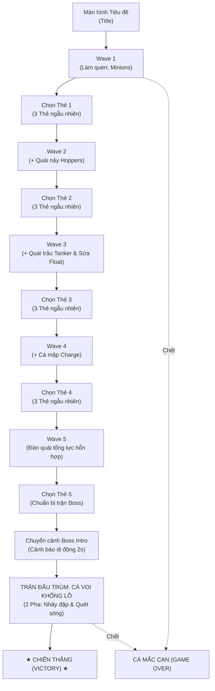

# 躍る (Odoru) / Just a Fish Game

> **3D Arena Survivor Roguelite thuần C++ & DxLib**  
> Dự án môn học: *ゲーム制作演習-II (Thực hành làm game II)*  
> Tác giả: Katsuragi Shin  
> Phiên bản: **Cơ chế cải tiến "Nhảy để tấn công" (Jump-to-Attack)**

> [!INFO] 🔗 Mạng lưới Ghi chú Obsidian (Obsidian Vault Links)
> - 🏛️ **Kiến trúc Hệ thống Hiện tại**: [[Odoru_Current_Architecture|Odoru_Current_Architecture.md]]
> - 📑 **Hồ sơ Đặc tả Kỹ thuật Toàn diện**: [[Odoru_Technical_Specification|Odoru_Technical_Specification.md]]
> - 📄 **Tài liệu Ý tưởng & Thiết kế Gốc**: [[fish game|fish game.md]]

---

## 1. Giới thiệu tổng quan (Overview)

**躍る (Odoru)** là một tựa game sinh tồn trong đấu trường khép kín (3D Arena Survivor Roguelite) lấy cảm hứng từ phong cách gameplay tối giản của *Brotato*.  
Chủ đề **"躍る"** mang hai tầng ý nghĩa:
1. **Nghĩa đen**: Chú cá di chuyển bằng cách bơi lội mượt mà và nhảy vọt lên không trung, dậm đất tạo sóng xung kích chấn động để tiêu diệt đàn quái vật biển sâu.
2. **Nghĩa bóng (胸躍る - Hưng phấn rạo rực)**: Nhịp độ chiến đấu nghẹt thở, người chơi canh thời điểm dậm đất chuẩn xác để vừa né đòn vừa dọn sạch đàn quái.

Toàn bộ game được xây dựng hoàn toàn từ số 0 bằng **C++17 và thư viện đồ họa DxLib** (x64), không sử dụng game engine thương mại (như Unity/Unreal). Vòng lặp vật lý đạt **120Hz Fixed Timestep** và không cấp phát bộ nhớ động (`new`/`malloc`) trong lúc chơi game nhằm tối ưu hoá triệt để hiệu năng.

---

## 2. Hướng dẫn Biên dịch & Điều khiển (Build & Controls)

### Yêu cầu môi trường
* **Hệ điều hành**: Windows 10/11 (x64)
* **IDE**: Visual Studio 2022 (v143 toolset)
* **Thư viện**: DxLib (x64) đặt tại thư mục `c:\DxLib\`
* **Tiêu chuẩn C++**: C++17

### Cách biên dịch và chạy
1. Mở tệp `FishGame.vcxproj` hoặc `FishGame.sln` bằng Visual Studio 2022.
2. Chọn cấu hình **Debug** (hoặc **Release**) và nền tảng **x64**.
3. Bấm **F5** để biên dịch và chạy game ngay lập tức.
4. Hoặc biên dịch bằng dòng lệnh MSBuild:
   ```powershell
   msbuild FishGame.vcxproj /p:Configuration=Debug /p:Platform=x64
   .\FishGame_debug.exe
   ```

### Bảng điều khiển (Controls)

| Phím bấm | Hành động | Mô tả |
|---|---|---|
| **`W`, `A`, `S`, `D`** / **Mũi tên** | **Bơi mượt mà** | Bơi lội tự do trên mặt phẳng $XZ$ ($Y = 0$), không tự nảy giật cục |
| **`SPACE`** | **Nhảy dậm đất (Slam)** | Phóng cá lên không trung; **bất tử suốt lúc bay**; tiếp đất gây sóng chấn động $120$ bán kính |
| **`A` / `D` + `ENTER`** hoặc **`1`, `2`, `3`** | **Chọn Thẻ Nâng Cấp** | Chọn 1 trong 3 thẻ sau khi vượt qua mỗi Wave |
| **`R`** | **Chơi lại (Restart)** | Reset toàn bộ ván chơi sạch sẽ về Wave 1 từ màn hình Thắng/Thua |
| **`T`** | **Về màn hình Tiêu đề** | Quay lại màn hình Title từ màn hình kết thúc |
| **`F1`** | **Bật/Tắt Debug HUD** | Xem trạng thái trên không, bán kính dậm, thời gian hồi chiêu, FPS |
| **`F2`** | **Bật/Tắt Rung Camera** | Tùy chọn rung chấn động khi dậm đất |
| **`N`** | **Đổi quái căn chỉnh 3D** | Chuyển đổi giữa 5 loại quái (Minion, Hopper, Tanker, Float, Charge) khi mở Debug HUD |
| **`<` / `>`** | **Chỉnh Scale mô hình** | Giảm/Tăng kích thước mô hình 3D quái đang chọn (hoặc `O`/`P` cho Cá chính) |
| **`M`** | **Xoay hướng mặt 3D** | Xoay bù $+90^\circ$ góc quay của mô hình quái đang chọn (hoặc `L` cho Cá chính) |

---

## 3. Vòng lặp Gameplay (Game Loop & Flow)



1. **Giai đoạn Wave (Wave 1 $\to$ 5)**:
   * Mỗi wave kéo dài từ $30$ đến $40$ giây.
   * Người chơi bơi né quái và bấm `SPACE` để dậm đất tiêu diệt quái.
   * Súng tự bắn được tắt bằng cờ `ENABLE_AUTO_GUN = false` để tập trung 100% vào cơ chế dậm đất.
   * Không dùng tiền tệ hay EXP shop; khi hết giờ wave, toàn bộ quái còn lại biến mất, người chơi **hồi phục ngay 30% máu tối đa** (`WAVE_HEAL_PERCENT`) và chuyển sang màn hình chọn thẻ.

2. **Giai đoạn Chọn Thẻ (Card Picking)**:
   * Hệ thống roll 3 thẻ ngẫu nhiên không trùng lặp, chia theo độ hiếm (Common / Rare / Epic).
   * Thẻ tác động trực tiếp vào cơ chế Lõi nhảy: tăng bán kính dậm, tăng sát thương, giảm hồi chiêu, nhảy thêm lần 2 trên không.

3. **Trùm Cuối (Whale Titan Boss)**:
   * Xuất hiện sau khi hoàn tất Wave 5 và lượt chọn thẻ cuối cùng.
   * Boss có 2 pha: **Pha 1** (100% - 50% HP) với đòn Nhảy đập dậm đất (báo hiệu decal đỏ $1.2s$) và Gọi đàn cá con; **Pha 2** (Cuồng nộ) tăng tốc độ, thêm đòn **Quét sóng ngang sàn** (bắt buộc người chơi phải bấm `SPACE` nhảy vọt qua để né đòn).
   * Tiêu diệt Boss sẽ đưa người chơi tới màn hình Chiến thắng (Victory).

---

## 4. Cơ chế Cốt lõi "Nhảy để tấn công" (Jump-to-Attack)

* **Bơi mượt mà không khựng**: Trên mặt sàn ($Y = 0$), cá bơi liên tục bằng WASD. Khi tiếp đất sau cú nhảy, cá **tiếp tục bơi ngay lập tức không bị đơ giật**.
* **Quỹ đạo Parabol trên trục Y**:
  $$y(t) = 4 \cdot H \cdot t \cdot (1 - t) \quad (t \in [0, 1])$$
  * $H = 85.0$: Độ cao nhảy.
  * $T = 0.6\,\text{s}$: Thời gian bay trên không.
* **Bất tử toàn phần trên không**: Miễn nhiễm sát thương trong suốt thời gian $y > 0$.
* **Điều khiển trên không (Air Control)**: Tốc độ lướt trên không nhân $1.25\times$, cho phép người chơi lượn và điều chỉnh điểm rơi chính xác.
* **Vòng decal báo điểm rơi**: Trong lúc cá bay, một vòng tròn decal trên mặt đất hiển thị chính xác bán kính và điểm rơi dự đoán theo thời gian thực.
* **Sóng xung kích tiếp đất**: Bán kính $120$, sát thương gốc $40$, đẩy lùi quái vật $320$. Rùa giáp chịu thêm sát thương và bị choáng $0.5\,\text{s}$. Sứa bay cũng bị trúng sóng.
* **Hit-Stop & Rung màn hình**: Khi dậm trúng quái vật, chỉ quái vật bị khựng ngắn $15 \sim 30\,\text{ms}$ tạo độ đanh thép, trong khi người chơi vẫn di chuyển mượt mà không bị trễ nhịp.

---

## 5. Bảng 8 Thẻ Nâng Cấp Chuẩn

| STT | Mã Thẻ | Tên Thẻ | Độ hiếm | Lợi ích | Đánh đổi |
|---|---|---|:---:|---|---|
| 1 | `vucsau` | **Vực sâu** | Common | Bán kính dậm đất `+25%` | Không đánh đổi |
| 2 | `cudam` | **Cú dậm** | Common | Sát thương dậm đất `+40%` | Hồi chiêu nhảy `+15%` |
| 3 | `nhaygon` | **Nhảy gọn** | Common | Hồi chiêu nhảy `-20%` | Sát thương dậm đất `-10%` |
| 4 | `vaynhanh` | **Vây nhanh** | Common | Tốc độ bơi `+15%` | Không đánh đổi |
| 5 | `daday` | **Da dày** | Common | Máu tối đa `+30%` | Tốc độ bơi `-8%` |
| 6 | `songdoi` | **Sóng dội** | Rare | Bán kính dậm `+35%`, lực đẩy `+30%` | Sát thương dậm đất `-10%` |
| 7 | `canoc` | **Cá nóc** | Rare | Khi bị trúng đòn, bắn 8 gai phản đòn | Máu tối đa `-15%` |
| 8 | `cudapnang` | **Cú đáp nặng** | Epic | Đẩy lùi quái `+100%`, sát thương `+30%` | Hồi chiêu nhảy `+20%` |

### Hệ thống Ảnh Thẻ & Giao diện (Task T2 & T3)
- **Thư mục tài nguyên**: `Data/UI/Card/` với quy ước tên chuẩn `<id>.png` (ví dụ `vucsau.png`, `canoc.png`...).
- **Nạp một lần (Zero Alloc Loop)**: Nạp toàn bộ qua `LoadGraph` đúng một lần trong `CardManager::Init()`, giải phóng bằng `DeleteGraph` khi thoát game.
- **Bố cục khung thẻ**: Khung 260x410, ô ảnh vuông 220x220 ở nửa trên vẽ bằng `DX_DRAWMODE_BILINEAR`, nửa dưới là tên thẻ, dòng lợi ích (xanh) và đánh đổi (đỏ). Có fallback an toàn không crash nếu thiếu file ảnh.

### Hạn chế đã biết (Known Limitations)
- Thẻ hiện tại tập trung thay đổi chỉ số trực tiếp (Stats Modifier), ngoại trừ Cá nóc có hook `OnHitTaken`.
- Cả 8 thẻ đều không cộng dồn (`stackable = false`). Các chỉ số `extraJumps`, `airSpeed`, hook `OnWaveEnd` được giữ nguyên trong core engine để mở rộng sau.

---

## 6. Kiến trúc Kỹ thuật (Technical Architecture)

1. **Fixed Timestep (120Hz)**:
   Logic vật lý chạy bước cố định $kStep = \frac{1}{120}\,\text{s}$ ($\approx 8.33\,\text{ms}$) ngăn chặn triệt để hiện tượng đạn xuyên quái hoặc trễ va chạm khi biến thiên FPS.
2. **Zero Dynamic Allocation (Object Pooling)**:
   Mọi thực thể (quái vật, đạn phản đòn, sóng nước, hạt particle) đều cấp phát trước trong `std::array` cố định, loại bỏ hoàn toàn `new/delete` trong game loop.
3. **Phân rã không gian 2.5D**:
   Tách rời di chuyển thực trên mặt phẳng $XZ$ với cao độ nảy parabol trên trục $Y$.
4. **Spatial Hash Grid**:
   Phân vùng va chạm $O(N)$ bằng lưới ô không gian thay cho so sánh $O(N^2)$, giữ vững $120\,\text{FPS}$ mượt mà ngay cả khi hàng trăm quái vật xuất hiện cùng lúc.
